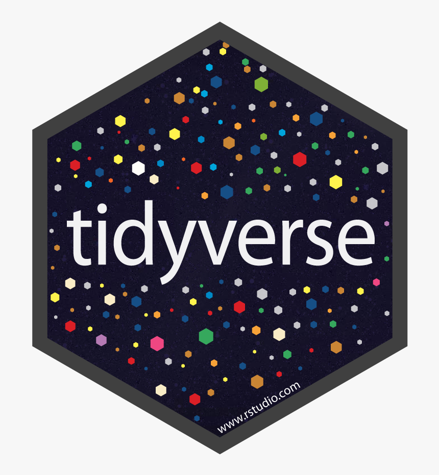

# Data Cleaning

- [1. Getting Ready: Installing
  Packages](#1-getting-ready-installing-packages)
- [2. Getting data](#2-getting-data)
- [3. Preparing our Workspace](#3-preparing-our-workspace)
  - [3.1 Working directory](#31-working-directory)
  - [3.2 Read data](#32-read-data)
  - [3.3 Preview data](#33-preview-data)
- [4. Introducing Piping](#4-introducing-piping)
  - [4.1 Before Piping](#41-before-piping)
  - [4.2 Piping](#42-piping)
- [5. Cleaning and validating data](#5-cleaning-and-validating-data)

<style type="text/css">
div.html-widget {
  overflow-x: auto;
}
&#10;table {
  display: block;
  max-width: none;
  white-space: nowrap;
}
</style>



Before we start any analysis, we need to make sure our data is properly
organized and cleaned. In this section, we will work with a dataset to
go through some steps that you can take to check your data, correct any
mistakes, and make sure the data is ready for your analyses.

Remember, if you or your group have any questions or get stuck as you
work through this in-class exercise, please ask the instructor for
assistance. Have fun!

## 1. Getting Ready: Installing Packages

One of the most fascinating things about R is that it has an active
community developing a lot of packages everyday, which makes R powerful.
A package is a compilation of functions (data sets, code, documentations
and tests) external to R that provide it with additional capabilities.

We can install packages in the console using the `install.packages()`
function. You should use the console and **not** the code editor to run
this code because you only need to install the package once.

<div class="task-box" markdown="1">

⭐ <u>Task 1-1</u>

**Install the tidyverse and assert packages in the Console window.**

Package names: tidyverse and assertr.

Do not worry about what they do now, we will go through these packages
throughout this workshop. Now, we just want to make sure they are
properly installed and loaded.

{::options parse_block_html='true' /}
<details>

<summary>

Check your code
</summary>

``` r
install.packages("tidyverse") # Install the tidyverse package
```

    ## Warning: package 'tidyverse' is in use and will not be installed

``` r
install.packages("assertr") # Install the assertr package
```

    ## Warning: package 'assertr' is in use and will not be installed

</details>

{::options parse_block_html='false'/}

*Hint:* wrap the package name in `""` quotations, because it is a string
type.

</div>

*Note:* The installation may take a while, sometimes up to 10-15
minutes. When it’s complete, the right angle bracket `>` will appear at
the last line of your console.

**Confirm installation**

To check if the package is installed, enter the following in the console

``` r
# Paste both lines into the console, and then run. 
installed <- installed.packages() # this creates an object with names of installed packages
"tidyverse" %in% rownames(installed) # this looks for tidyverse in that object
## [1] TRUE
"assertr" %in% rownames(installed) # this looks for tidyverse in that object
## [1] TRUE
```

**Load the libraries.**

After we install a package, we have to load it using the `library()`
function.

- Do not wrap the package name in quotes when using `library()`.

{::options parse_block_html='true' /}
<details>

<summary>

Why no quotations for library()?
</summary>

When you install a package in R using **`install.packages()`**, the
package name must be a character string, hence the quotes. This is
because **`install.packages()`** is a function that takes a character
vector as its argument, representing the names of the packages to be
installed.

However, when you load a package using **`library()`** or
**`require()`**, you’re not passing a character string; instead, you’re
using a non-evaluated expression that refers to the package name. Here,
the package name is an object of mode “name” which **`library()`**
interprets as the name of a package to load.

In summary, the quotes are needed for **`install.packages()`** because
it expects a character string, while **`library()`** is designed to take
an unquoted name that it interprets as a package name.

</details>

{::options parse_block_html='false'/}

- ❗ Put this command in your R script, not in the console. Why? The
  package only needs to be *installed* once, but it needs to be *loaded*
  any time you are running your script.

{::options parse_block_html='true' /}
<details>

<summary>

Check your code
</summary>

``` r
# Load the packages
library(tidyverse) 
library(assertr)
#then, as always, send the command to the console by
# clicking Ctrl + Enter (Windows) or Cmd +  Enter (Mac)
```

</details>

{::options parse_block_html='false'/}

## 2. Getting data

<div class="task-box" markdown="1">

⭐ <u>Task 5-2</u>

**Download data**

From [this
link](docs/Global_Superstore_Orders_2016.csv){:target=“\_blank”}
download the following data we have prepared for you to use in this
workshop.

Save the file in the same folder as your R script. This folder will be
your working directory.

</div>


*If you have your own data, you may use that as well although it may not
line up with the instructions in the activity.* <br>

## 3. Preparing our workspace

### 3.1 Working directory

First, let’s set our working directory so that R knows which folder to
look for data.

<div class="task-box" markdown="1">

⭐ <u>Task 1-2</u>

**Set your working directory**

{::options parse_block_html='true' /}
<details>

<summary>

Check your code
</summary>

``` r
# Set working directory
setwd("path-to-folder") # the path will be different for each person
```

*Note:* remember that you should use forward brackets to define your
working directory, for example: `setwd("C:/Users/Name/Documents")`.

</details>

{::options parse_block_html='false'/}

</div>

### 3.2 Read data

After loading the package and setting your working directory, you should
be ready to load the data into R. In this activity, we will be working
with a table containing information about shipping orders. Each row
represents one order, and each column represents a specific type of data
about the orders.

<div class="task-box" markdown="1">

⭐ <u>Task 1-3</u>

**Load data**

Load your data into an object called `purchaseData`. *Hint:* go back to
the last section to check which function to use to import .csv files.

{::options parse_block_html='true' /}
<details>

<summary>

Check your code
</summary>

``` r
# Load data
purchaseData <- read.csv("docs/Global_Superstore_Orders_2016.csv")
```

``` r
# Load data
purchaseData <- read.csv("Global_Superstore_Orders_2016.csv")
```

</details>

{::options parse_block_html='false'/}

</div>

### 3.3 Preview data

After loading your data into R, it is good practice to check your data
to make sure it loaded correctly.

❗ For larger data sets, it’s better to *preview* than *view* our data.
Purchase Data has quite a few columns and rows! Let’s take a look at the
first few rows and get the dimensions (number of rows and columns) of
the data set.

We can preview the data set using the `head()` function. This will
display the first number of rows.

- Parameters of the `head()` function (in order):
  - data set name
  - number of rows to display

*Note:* In cases where there are more columns that fit horizontally in
the console, the results will wrap, as seen in the output of Task 1-4.

<div class="task-box" markdown="1">

⭐ <u>Task 1-4</u>

**Look at the first 5 rows of our purchase data.**

{::options parse_block_html='true' /}
<details>

<summary>

Check your code
</summary>

``` r
# name of data set name: "purchaseData"
# number of rows to display: 5
head(purchaseData, 5)
```

The following will be the output (For the purpose of readability, this
only shows 5 columns. Your output will be much wider, and the columns
will continue to wrap below!):

    ##   Row_ID                 Order_ID Order_Date  Ship_Date    Ship_Mode
    ## 1  40098 CA-2014-AB10015140-41954 2014-11-11 2014-11-13  First Class
    ## 2  26341   IN-2014-JR162107-41675 2014-02-05 2014-02-07 Second Class
    ## 3  25330   IN-2014-CR127307-41929 2014-10-17 2014-10-18  First Class
    ## 4  13524  ES-2014-KM1637548-41667 2014-01-28 2014-01-30  First Class
    ## 5  47221  SG-2014-RH9495111-41948 2014-11-05 2014-11-06     Same Day

</details>

{::options parse_block_html='false'/}

*Hint:*`head(datasetName, numberOfRows)`

</div>

You can use this to check if the correct columns have been imported.

Now, we’ve imported our data and previewed the first 5 rows of our
purchase data, but how big is the data set?

- How many rows?
- How many columns?

We can find out the dimensions (rows and columns) using the`dim()`
function. This function takes only one parameter, the data set name.

<div class="task-box" markdown="1">

⭐ <u>Task 1-5</u>

**Find out the dimensions of the data set**, i.e., number of rows and
columns.

{::options parse_block_html='true' /}
<details>

<summary>

Check your code
</summary>

``` r
## name of data set name: "purchaseData"
dim(purchaseData)
```

    ## [1] 51290    24

</details>

{::options parse_block_html='false'/}

</div>

You can use the `dim()` function to check if the correct number of rows
and columns has been imported. In this case, the table imported has
51290 observations (i.e., rows) for 24 variables (i.e., columns). If you
know the size of your dataset, you can check if everything was imported
here.

At this point, you have gone through the four major steps that are
recommended at the start of your script to set the stage for your
analysis: - Load any packages - Set working directory - Load data -
Inspect and check if data was correctly imported.

This is how your script should look so far:

``` r
# Organizing the workspace

## load packages
library(tidyverse)

## Set working directory
setwd("path-to-folder") # the path will be different for each person

## load data
purchaseData <- read.csv("Global_Superstore_Orders_2016.csv")

## check data
head(purchaseData, 5)
dim(purchaseData)
```

📍 Reminder! Save your work

## 4. Introducing Piping

Before we start with how to clean, manipulate and visualize our data, we
want to introduce you to the `|>` symbol, which is very powerful to use
in conjunction with the tidyverse package to easily manipulate and
visualize data.

This symbol is known as a “pipe”, and it’s used for feeding the result
of one function directly into the next function.

**Note:** The symbol `%>%` is also a “pipe” and comes from the
`tidyverse` package, while the symbol `|>` is the base R pipe symbol.
Both symbols will work exactly the same in most cases. We will use the
`|>` symbol, which is now considered the standard pipe symbol, but know
that if you see `%>%` in older tutorials or more specific `tidyverse`
documentation, you can interpret it in the same way as `|>`. If you want
to know more about their differences, you can check [this
link](https://tidyverse.org/blog/2023/04/base-vs-magrittr-pipe/)

- e.g., Imagine you wanted to sort the column of your dataset in
  alphabetical order, you could either enter:
  - Two separate commands creating two data objects
  - Use a pipe to create one data object for your target object.

This might be difficult to understand now, and that’s why we will, in
the next two sections, first try manipulating a data frame without using
pipe, and then do the same using pipe, so that you understand the
difference and the power of using pipe.

In pipes, you can choose to have a newline (shift+enter) after the `|>`
symbol or leave it all on one line. For a cleaner code, we recommend
adding a new line.

### 4.1 Manipulating dataframes without piping

In the introductory workshop, we have looked at commands that perform
single operations:

- Create an object whose value is a single word
  - `y <- "word"`
- Create an object whose value is defined by a mathematical expression
  - `x <- 1-2`
- View the dimensions of a data set
  - `dim(purchaseData)`

Piping becomes powerful when we want to perform multiple functions at
once to achieve a single result. For example, what if we want to get a
list of column names in our data set, AND sort it alphabetically? Let’s
first see how to this without piping.

- There are 2 ways that we can do this without piping, based on basic R
  commands.

**First option: separate commands**

To get our list of column names sorted alphabetically, we first need to
get the column names.

- To get a list of column names, we can use the `names()` function.
  - parameter: data frame
  - In this case, results appear in a vector rather than a list because
    the column names are all the same data type (strings).
  - *Note*: The `names()` function is only useful for data frames and
    matrices for which we have column names.

<div class="task-box" markdown="1">

⭐ <u>Task 1-6</u>

**Create an object**

Create an object containing the list of column names from our purchase
data.

- Name this object `purchaseDataColumnNames`

{::options parse_block_html='true' /}
<details>

<summary>

Check your code
</summary>

``` r
purchaseDataColumnNames <- names(purchaseData)
```

</details>

{::options parse_block_html='false'/}

</div>

Then, after we have the list of column names, we can sort the vector
into ascending and descending order (low to high or high to low) using
the `sort()` function.

- Parameter: the vector of values to be sorted

<div class="task-box" markdown="1">

⭐ <u>Task 1-7</u>

**Create an object**

Create an object containing the alphabetically-sorted list of column
names from our purchase data.

- Name this object `alphaPurchaseDataColumnNames`

{::options parse_block_html='true' /}
<details>

<summary>

Check your code
</summary>

``` r
alphaPurchaseDataColumnNames <- sort(purchaseDataColumnNames)
```

</details>

{::options parse_block_html='false'/}

*Hint:* You already created the vector containing the list of column
names from our purchase data in the previous task!

</div>

**Second option: nesting**

In Tasks 1-6 and 1-7, we ran two commands, resulting in two separate
objects containing the column names:

- `purchaseDataColumnNames`: Ordered as they would be if the file were
  opened in Excel
- `alphaPurchaseDataColumnNames`: Ordered alphabetically (sorted)

However, we only care about the list of alphabetically column names.

- We can achieve that using only 1 command, creating only 1 object with
  “nesting”.

**Definition - Nesting:** Use one function as a parameter of another
function. - e.g., `function1(function2(parameter))`

<div class="task-box" markdown="1">

⭐ <u>Task 1-8</u>

**Create an object through nested functions**

In this task, use nesting to create one object containing the sorted
vector of column names with a single line of code. - Name this object:
`alphabeticalColumnNames`

{::options parse_block_html='true' /}
<details>

<summary>

Check your code
</summary>

``` r
# names(purchaseData) creates a vector object of the column names from our purchase data
# sort() Orders the items in the purchase data column names alphabetically
alphabeticalColumnNames <- sort(names(purchaseData))
```

</details>

{::options parse_block_html='false'/}

<br> *Hints*: the parameter of `sort()` is the `names()` function, and
the parameter of `names()` is the data set.

</div>

As you might imagine, nesting could result in very long commands that
would be hard to interpret.

There is a cleaner way to do this than nesting: (you guessed it
correctly) piping!

### 4.2 Piping

To pipe a command instead of nesting, we will enter the commands
sequentially, separated by the pipe symbol `|>`.

For example, to get the list of alphabetically-sorted column names, you
would use the following code:

``` r
alphabeticalColumnNames <- purchaseData |> # this line gets the purchaseData object and pipes into ...
                           names() |> # the names function, which will get the column names of the purchaseData dataframe, and then pipe into ...
                           sort() # the sort function, which will sort the names
# All of those commands will be saved in the alphabeticalColumnNames objects that you created in the first line
```

- As a general code, here is how you would create a new object with 2
  commands (functions or expressions):

``` r
newObject <- startingObject |>
             command1() |>
             command2()
```

- If you don’t want to save the result of your pipe and just want to
  preview it, you don’t need to assign it to an object:

``` r
startingObject |>
    command1() |>
    command2()
```

<div class="task-box" markdown="1">

⭐ <u>Task 1-8</u>

**Create an object through piping**

In this task, use piping to create one object containing the first 5
column names.

- Do not use objects you have created so far, except `purchaseData`
- Name your new variable: `purchaseDataNamesPeek`

{::options parse_block_html='true' /}
<details>

<summary>

Check your code
</summary>

``` r
# 'purchaseDataNamesPeek <-' creates a new variable
# purchaseData gets the dataframe to start
# The first pipe '|>' passes the dataframe to the 'names()' function,
# the names() function then returns a vector of the column names
# The second pipe '|>' passes the names vector to the 'head()' function
# 'head(5)' then extracts the first five elements (column names) of this vector
# The result is a 5-item vector of column names assigned to 'purchaseDataNamesPeek'
purchaseDataNamesPeek <- purchaseData |>
                         names() |>
                         head(5)

# remember, you can view the value assigned to an object by entering just that object name
purchaseDataNamesPeek
```

    ## [1] "Row_ID"     "Order_ID"   "Order_Date" "Ship_Date"  "Ship_Mode"

</details>

{::options parse_block_html='false'/}

*Hint*: you can use the functions `names()` and `head()` to do this.

</div>

If you want to simply view what the first five column names are, but
don’t need to reference them later, you don’t need to create a new
object.

{::options parse_block_html='true' /}
<details>

<summary>

Show code for previewing with piping
</summary>

``` r
# Do not begin the command with `newVariableName <-`
purchaseData |>
  names() |>
  head(5)
```

    ## [1] "Row_ID"     "Order_ID"   "Order_Date" "Ship_Date"  "Ship_Mode"

</details>

{::options parse_block_html='false'/}

If you want to know more about pipe, and how it is more intuitive than
other ways to write code, check out
[this](https://r4ds.had.co.nz/pipes.html#pipes){:target=“\_blank”}.

## 5. Cleaning and validating data

<script>  
function toggle(input) {
    var x = document.getElementById(input);
    if (x.style.display === "none") {
        x.style.display = "block";
    } else {
        x.style.display = "none";
    }
}
</script>

<style>
details {
    background-color: lightgray; 
    padding: 10px;
    margin: 5px;
    border-radius: 5px;
}
.task-box {
      border: 1.5px solid #ccc;
      padding: 10px;
      margin: 10px 0;
      border-radius: 5px;
      background-color: #f5f2f6;
  }
  &#10;</style>

<!--https://gist.github.com/rxaviers/7360908-->

[NEXT STEP: Data manipulation](data-manipulation.html){: .btn .btn-blue
}
