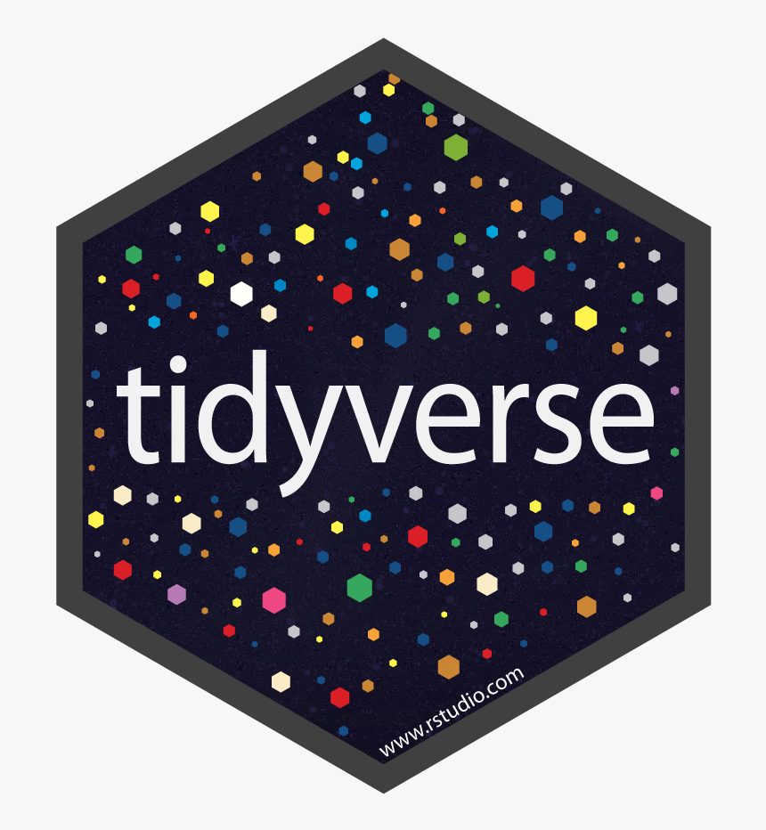

# Data Cleaning

- [1. Getting ready: installing
  packages](#1-getting-ready-installing-packages)
- [2. Getting data](#2-getting-data)
- [3. Preparing our workspace](#3-preparing-our-workspace)
  - [3.1 Working directory](#31-working-directory)
  - [3.2 Read data](#32-read-data)
  - [3.3 Preview data](#33-preview-data)
- [4. Introducing piping](#4-introducing-piping)
  - [4.1 Before piping](#41-before-piping)
  - [4.2 Piping](#42-piping)
- [5. Cleaning and validating data](#5-cleaning-and-validating-data)
  - [5.1 Fixing column names](#51-fixing-column-names)
  - [5.2 Correcting variable types](#52-correcting-variable-types)
  - [5.3 Validating your data](#53-validating-your-data)

<style type="text/css">
div.html-widget {
  overflow-x: auto;
}
&#10;table {
  display: block;
  max-width: none;
  white-space: nowrap;
}
</style>



Before we start any analysis, we need to make sure our data is properly
organized and cleaned. In this section, we will work with a dataset to
go through some steps that you can take to check your data, correct any
mistakes, and make sure the data is ready for your analyses.

Remember, if you or your group have any questions or get stuck as you
work through this in-class exercise, please ask the instructor for
assistance. Have fun!

## 1. Getting ready: installing packages

One of the most fascinating things about R is that it has an active
community developing a lot of packages everyday, which makes R very
powerful. A package is a compilation of functions (data sets, code,
documentations and tests) external to R that provide it with additional
capabilities.

We can install packages in the console using the `install.packages()`
function. You should use the console and **not** the code editor to run
this code because you only need to install the package once.

<div class="task-box" markdown="1">

⭐ <u>Task 1-1</u>

**Install the `tidyverse`, `janitor`, and `assert` packages in the
Console window.**

Package names: `tidyverse`, `janitor`, and `assertr`.

Do not worry about what they do now, we will go through these packages
throughout this workshop. Now, we just want to make sure they are
properly installed and loaded.

{::options parse_block_html='true' /}
<details>

<summary>

Check your code
</summary>

``` r
install.packages("tidyverse") # Install the tidyverse package
install.packages("janitor") # Install the janitor package
install.packages("assertr") # Install the assertr package
```

</details>

{::options parse_block_html='false'/}

*Hint:* wrap the package name in `""` quotations, because it is a string
type.

</div>

*Note:* The installation may take a while, sometimes up to 10-15
minutes. When it’s complete, the right angle bracket `>` will appear at
the last line of your console.

**Confirm installation**

To check if the package is installed, enter the following in the console

``` r
# Paste both lines into the console, and then run. 
installed <- installed.packages() # this creates an object with names of installed packages
"tidyverse" %in% rownames(installed) # this looks for tidyverse in that object
## [1] TRUE
"janitor" %in% rownames(installed) # this looks for janitor in that object
## [1] TRUE
"assertr" %in% rownames(installed) # this looks for assertr in that object
## [1] TRUE
```

**Load the libraries.**

After we install a package, we have to load it using the `library()`
function.

- Do not wrap the package name in quotes when using `library()`.

{::options parse_block_html='true' /}
<details>

<summary>

Why no quotations for library()?
</summary>

When you install a package in R using **`install.packages()`**, the
package name must be a character string, hence the quotes. This is
because **`install.packages()`** is a function that takes a character
vector as its argument, representing the names of the packages to be
installed.

However, when you load a package using **`library()`** or
**`require()`**, you’re not passing a character string; instead, you’re
using a non-evaluated expression that refers to the package name. Here,
the package name is an object of mode “name” which **`library()`**
interprets as the name of a package to load.

In summary, the quotes are needed for **`install.packages()`** because
it expects a character string, while **`library()`** is designed to take
an unquoted name that it interprets as a package name.

</details>

{::options parse_block_html='false'/}

- ❗ Put this command in your R script, not in the console. Why? The
  package only needs to be *installed* once, but it needs to be *loaded*
  any time you are running your script.

{::options parse_block_html='true' /}
<details>

<summary>

Check your code
</summary>

``` r
# Load the packages
library(tidyverse) 
library(janitor)
library(assertr)
```

</details>

{::options parse_block_html='false'/}

## 2. Getting data

<div class="task-box" markdown="1">

⭐ <u>Task 1-2</u>

**Download data**

From [this
link](docs/Global_Superstore_Orders_2016.csv){:target=“\_blank”}
download the following data we have prepared for you to use in this
workshop.

Save the file in the same folder as your R script. This folder will be
your working directory.

</div>


*If you have your own data, you may use that as well although it may not
line up with the instructions in the activity.* <br>

## 3. Preparing our workspace

### 3.1 Working directory

First, let’s set our working directory so that R knows which folder to
look for data.

<div class="task-box" markdown="1">

⭐ <u>Task 1-3</u>

**Set your working directory**

{::options parse_block_html='true' /}
<details>

<summary>

Check your code
</summary>

``` r
# Set working directory
setwd("path-to-folder") # the path will be different for each person
```

*Note:* remember that you should use forward brackets to define your
working directory, for example: `setwd("C:/Users/Name/Documents")`.

</details>

{::options parse_block_html='false'/}

</div>

### 3.2 Read data

After loading the package and setting your working directory, you should
be ready to load the data into R. In this activity, we will be working
with a table containing information about shipping orders. Each row
represents one order, and each column represents a specific type of data
about the orders.

<div class="task-box" markdown="1">

⭐ <u>Task 1-3</u>

**Load data**

Load your data into an object called `purchaseData`.

*Hint:* go back to the [introductory R Studio
workshop](https://uviclibraries.github.io/rstudio/basics-importing-data.html)
if you need to check which function to use to import .csv files.

{::options parse_block_html='true' /}
<details>

<summary>

Check your code
</summary>

``` r
# Load data
purchaseData <- read.csv("Global_Superstore_Orders_2016.csv")
```

</details>

{::options parse_block_html='false'/}

</div>

### 3.3 Preview data

After loading your data into R, it is good practice to check your data
to make sure it loaded correctly.

❗ For larger data sets, it’s better to *preview* than *view* our data.
Purchase Data has quite a few columns and rows! Let’s take a look at the
first few rows and get the dimensions (number of rows and columns) of
the data set.

We can preview the data set using the `head()` function. This will
display the first number of rows.

- Parameters of the `head()` function (in order):
  - data set name
  - number of rows to display

*Note:* In cases where there are more columns that fit horizontally in
the console, the results will wrap, as seen in the output of Task 1-4.

<div class="task-box" markdown="1">

⭐ <u>Task 1-4</u>

**Look at the first 5 rows of our purchase data.**

{::options parse_block_html='true' /}
<details>

<summary>

Check your code
</summary>

``` r
# name of data set name: "purchaseData"
# number of rows to display: 5
head(purchaseData, 5)
```

The following will be the output (For the purpose of readability, this
only shows 5 columns. Your output will be much wider, and the columns
will continue to wrap below!):

    ##   row_id                 Order_ID Order.Date  SHIP.DATE    Ship_Mode
    ## 1  40098 CA-2014-AB10015140-41954 2014-11-11 2014-11-13  First Class
    ## 2  26341   IN-2014-JR162107-41675 2014-02-05 2014-02-07 Second Class
    ## 3  25330   IN-2014-CR127307-41929 2014-10-17 2014-10-18  First Class
    ## 4  13524  ES-2014-KM1637548-41667 2014-01-28 2014-01-30  First Class
    ## 5  47221  SG-2014-RH9495111-41948 2014-11-05 2014-11-06     Same Day

</details>

{::options parse_block_html='false'/}

*Hint:*`head(datasetName, numberOfRows)`

</div>

You can use this to check if the correct columns have been imported.

Now, we’ve imported our data and previewed the first 5 rows of our
purchase data, but how big is the data set?

- How many rows?
- How many columns?

We can find out the dimensions (rows and columns) using the `dim()`
function. This function takes only one parameter, the data set name.

<div class="task-box" markdown="1">

⭐ <u>Task 1-5</u>

**Find out the dimensions of the data set**, i.e., number of rows and
columns.

{::options parse_block_html='true' /}
<details>

<summary>

Check your code
</summary>

``` r
## name of data set name: "purchaseData"
dim(purchaseData)
```

    ## [1] 51290    24

</details>

{::options parse_block_html='false'/}

</div>

You can use the `dim()` function to check if the correct number of rows
and columns has been imported. In this case, the table imported has
51290 observations (i.e., rows) for 24 variables (i.e., columns). If you
know the size of your dataset, you can check if everything was imported
here.

Another way to inspect your data is to use the `str()` function.

<div class="task-box" markdown="1">

⭐ <u>Task 1-6</u>

**See the structure of your data.**

{::options parse_block_html='true' /}
<details>

<summary>

Check your code
</summary>

``` r
# Check data
str(purchaseData)
```

    ## 'data.frame':    51290 obs. of  24 variables:
    ##  $ row_id        : int  40098 26341 25330 13524 47221 22732 30570 31192 40099 36258 ...
    ##  $ Order_ID      : chr  "CA-2014-AB10015140-41954" "IN-2014-JR162107-41675" "IN-2014-CR127307-41929" "ES-2014-KM1637548-41667" ...
    ##  $ Order.Date    : chr  "2014-11-11" "2014-02-05" "2014-10-17" "2014-01-28" ...
    ##  $ SHIP.DATE     : chr  "2014-11-13" "2014-02-07" "2014-10-18" "2014-01-30" ...
    ##  $ Ship_Mode     : chr  "First Class" "Second Class" "First Class" "First Class" ...
    ##  $ customer_ID   : chr  "AB-100151402" "JR-162107" "CR-127307" "KM-1637548" ...
    ##  $ Customer_name : chr  "Aaron Bergman" "Justin Ritter" "Craig Reiter" "Katherine Murray" ...
    ##  $ Segment       : chr  "Consumer" "Corporate" "Consumer" "Home Office" ...
    ##  $ Postal.Code   : int  73120 NA NA NA NA NA NA NA 73120 98103 ...
    ##  $ City          : chr  "Oklahoma City" "Wollongong" "Brisbane" "Berlin" ...
    ##  $ STATE         : chr  "Oklahoma" "New South Wales" "Queensland" "Berlin" ...
    ##  $ Country       : chr  "United States" "Australia" "Australia" "Germany" ...
    ##  $ Region        : chr  "Central US" "Oceania" "Oceania" "Western Europe" ...
    ##  $ Market        : chr  "USCA" "Asia Pacific" "Asia Pacific" "Europe" ...
    ##  $ Product.ID    : chr  "TEC-PH-5816" "FUR-CH-5379" "TEC-PH-5356" "TEC-PH-5267" ...
    ##  $ Category      : chr  "Technology" "Furniture" "Technology" "Technology" ...
    ##  $ sub_category  : chr  "Phones" "Chairs" "Phones" "Phones" ...
    ##  $ Product_Name  : chr  "Samsung Convoy 3" "Novimex Executive Leather Armchair, Black" "Nokia Smart Phone, with Caller ID" "Motorola Smart Phone, Cordless" ...
    ##  $ Sales         : num  222 3709 5175 2893 2833 ...
    ##  $ Quantity      : int  2 9 9 5 8 5 4 6 2 1 ...
    ##  $ Discount      : num  0 0.1 0.1 0.1 0 0.1 0 0 0 0.2 ...
    ##  $ Profit        : num  62.1 -288.8 920 -96.5 311.5 ...
    ##  $ Shipping.Cost : num  40.8 923.6 915.5 910.2 903 ...
    ##  $ Order_Priority: chr  "High" "Critical" "Medium" "Medium" ...

</details>

{::options parse_block_html='false'/}

</div>

With this, you can also see the dimensions of the dataset, but the
result also shows you the names of the variables and the type of each
variable.

At this point, you have gone through the four major steps that are
recommended at the start of your script to set the stage for your
analysis: - Load any packages - Set working directory - Load data -
Inspect and check if data was correctly imported.

This is how your script should look so far:

``` r
# Organizing the workspace

## load packages
library(tidyverse)
library(assertr)
library(janitor)

## Set working directory
setwd("path-to-folder") # the path will be different for each person

## load data
purchaseData <- read.csv("Global_Superstore_Orders_2016.csv")

## check data
head(purchaseData, 5)
dim(purchaseData)
str(purchaseData)
```

When doings these steps, you can identify certain elements of your
dataset that you might want to clean before starting with data
visualization and analysis. In the above example, you can see that
variable names do not have a standardized format such as all lower caps,
or using only “.” or “\_” instead of spaces. This is one the steps we
will perform in the cleaning stage, so keep in this mind. But before
that, let’s talk about piping, which will help us for data cleaning and
data manipulation.

📍 Reminder! Save your work

## 4. Introducing Piping

Before we start with how to clean (this activity), manipulate and
visualize our data (next activities), we want to introduce you to the
`|>` symbol, which is very powerful to use in conjunction with the
`tidyverse` package to easily manipulate and visualize data.

This symbol is known as a “pipe”, and it’s used for feeding the result
of one function directly into the next function.

**Note:** The symbol `%>%` is also a “pipe” and comes from the
`tidyverse` package, while the symbol `|>` is the base R pipe symbol.
Both symbols will work exactly the same in most cases. We will use the
`|>` symbol, which is now considered the standard pipe symbol, but know
that if you see `%>%` in older tutorials or more specific `tidyverse`
documentation, you can interpret it in the same way as `|>`. If you want
to know more about their differences, you can check [this
link](https://tidyverse.org/blog/2023/04/base-vs-magrittr-pipe/).

- e.g., Imagine you wanted to sort the column of your dataset in
  alphabetical order, you could either enter:
  - Two separate commands creating two data objects
  - Use a pipe to create one data object for your target object.

This might be difficult to understand now, and that’s why we will, in
the next two sections, first try manipulating a data frame without using
pipe, and then do the same using pipe, so that you understand the
difference and the power of using pipe.

In pipes, you can choose to have a newline after the `|>` symbol or
leave it all on one line. For a cleaner code, we recommend adding a new
line.

### 4.1 Manipulating dataframes without piping

In the introductory workshop, we have looked at commands that perform
single operations:

- Create an object whose value is a single word
  - `y <- "word"`
- Create an object whose value is defined by a mathematical expression
  - `x <- 1-2`
- View the dimensions of a data set
  - `dim(purchaseData)`

Piping becomes powerful when we want to perform multiple functions at
once to achieve a single result. For example, what if we want to get a
list of column names in our data set, AND sort it alphabetically? Let’s
first see how to this without piping.

- There are 2 ways that we can do this without piping, based on basic R
  commands.

**First option: separate commands**

To get our list of column names sorted alphabetically, we first need to
get the column names.

- To get a list of column names, we can use the `names()` function.
  - parameter: data frame
  - *Note*: The `names()` function is only useful for data frames and
    matrices for which we have column names.

<div class="task-box" markdown="1">

⭐ <u>Task 1-7</u>

**Create an object**

Create an object containing the list of column names from our purchase
data.

- Name this object `purchaseDataColumnNames`

{::options parse_block_html='true' /}
<details>

<summary>

Check your code
</summary>

``` r
purchaseDataColumnNames <- names(purchaseData)
```

</details>

{::options parse_block_html='false'/}

</div>

Then, after we have the list of column names, we can sort the vector
into ascending and descending order (low to high or high to low) using
the `sort()` function.

- Parameter: the vector of values to be sorted

<div class="task-box" markdown="1">

⭐ <u>Task 1-8</u>

**Create an object**

Create an object containing the alphabetically-sorted list of column
names from our purchase data.

- Name this object `alphaPurchaseDataColumnNames`

{::options parse_block_html='true' /}
<details>

<summary>

Check your code
</summary>

``` r
alphaPurchaseDataColumnNames <- sort(purchaseDataColumnNames)
```

</details>

{::options parse_block_html='false'/}

*Hint:* You already created the vector containing the list of column
names from our purchase data in the previous task!

</div>

**Second option: nesting**

In Tasks 1-7 and 1-8, we ran two commands, resulting in two separate
objects containing the column names:

- `purchaseDataColumnNames`: Ordered as they would be if the file were
  opened in Excel
- `alphaPurchaseDataColumnNames`: Ordered alphabetically (sorted)

However, we only care about the list of alphabetically-sorted column
names.

- We can achieve that using only 1 command, creating only 1 object with
  “nesting”.

**Definition - Nesting:** Use one function as a parameter of another
function. - e.g., `function1(function2(parameter))`

<div class="task-box" markdown="1">

⭐ <u>Task 1-9</u>

**Create an object through nested functions**

In this task, use nesting to create one object containing the sorted
vector of column names with a single line of code.

Name this object: `alphabeticalColumnNames`

{::options parse_block_html='true' /}
<details>

<summary>

Check your code
</summary>

``` r
# names(purchaseData) creates a vector object of the column names from our purchase data
# sort() Orders the items in the purchase data column names alphabetically
alphabeticalColumnNames <- sort(names(purchaseData))
```

</details>

{::options parse_block_html='false'/}

<br> *Hints*: the parameter of `sort()` is the `names()` function, and
the parameter of `names()` is the data set.

</div>

As you might imagine, nesting could result in very long commands that
would be hard to interpret.

There is a cleaner way to do this than nesting: (you guessed it
correctly) piping!

### 4.2 Piping

To pipe a command instead of nesting, we will enter the commands
sequentially, separated by the pipe symbol `|>`.

For example, to get the list of alphabetically-sorted column names, you
would use the following code:

``` r
alphabeticalColumnNames <- purchaseData |> # this line gets the purchaseData object and pipes into ...
                           names() |> # the names function, which will get the column names of the purchaseData dataframe, and then pipe into ...
                           sort() # the sort function, which will sort the names
# All of those commands will be saved in the alphabeticalColumnNames objects that you created in the first line
```

- As a general code, here is how you would create a new object with 2
  commands (functions or expressions):

``` r
newObject <- startingObject |>
             command1() |>
             command2()
```

- If you don’t want to save the result of your pipe and just want to
  preview it, you don’t need to assign it to an object:

``` r
startingObject |>
    command1() |>
    command2()
```

<div class="task-box" markdown="1">

⭐ <u>Task 1-10/u\>

**Create an object through piping**

In this task, use piping to create one object containing the first 5
column names.

- Do not use objects you have created so far, except `purchaseData`
- Name your new variable: `purchaseDataNamesPeek`

{::options parse_block_html='true' /}
<details>

<summary>

Check your code
</summary>

``` r
# 'purchaseDataNamesPeek <-' creates a new variable
# purchaseData gets the dataframe to start
# The first pipe '|>' passes the dataframe to the 'names()' function,
# the names() function then returns a vector of the column names
# The second pipe '|>' passes the names vector to the 'head()' function
# 'head(5)' then extracts the first five elements (column names) of this vector
# The result is a 5-item vector of column names assigned to 'purchaseDataNamesPeek'
purchaseDataNamesPeek <- purchaseData |>
                         names() |>
                         head(5)

# remember, you can view the value assigned to an object by entering just that object name
purchaseDataNamesPeek
```

    ## [1] "row_id"     "Order_ID"   "Order.Date" "SHIP.DATE"  "Ship_Mode"

</details>

{::options parse_block_html='false'/}

*Hint*: you can use the functions `names()` and `head()` to do this.

</div>

If you want to simply view what the first five column names are, but
don’t need to reference them later, you don’t need to create a new
object.

{::options parse_block_html='true' /}
<details>

<summary>

Show code for previewing with piping
</summary>

``` r
# Do not begin the command with `newVariableName <-`
purchaseData |>
  names() |>
  head(5)
```

    ## [1] "row_id"     "Order_ID"   "Order.Date" "SHIP.DATE"  "Ship_Mode"

</details>

{::options parse_block_html='false'/}

If you want to know more about pipe, and how it is more intuitive than
other ways to write code, check out
[this](https://r4ds.had.co.nz/pipes.html#pipes){:target=“\_blank”}.

## 5. Cleaning and validating data

Ok, now that we now how to use the pipe, let’s talk about basic function
to clean and validate your date.

### 5.1 Fixing column names

We often import data with column names that are not standardized, or
contain special characters that might break if kept in column names.
This is where the `janitor` package can help. It contains a function
called `clean_names()`, which automatically standardize column names
formatting. The `clean_names()` function requires only one parameter:
the dataframe name, and can be used with the pipe operator.

<div class="task-box" markdown="1">

⭐ <u>Task 1-11/u\>

**Standardize column names**

Use the `clean_names()` function to automatically standardize column
names formatting.

*Hint:* Remember to overwrite `purchaseData` with the object with the
new column names, otherwise R will not save the new column names.

{::options parse_block_html='true' /}
<details>

<summary>

Check your code
</summary>

``` r
## standardize column names
purchaseData <- purchaseData |>
  clean_names()

## view column names after standardization
names(purchaseData)
```

    ##  [1] "row_id"         "order_id"       "order_date"     "ship_date"     
    ##  [5] "ship_mode"      "customer_id"    "customer_name"  "segment"       
    ##  [9] "postal_code"    "city"           "state"          "country"       
    ## [13] "region"         "market"         "product_id"     "category"      
    ## [17] "sub_category"   "product_name"   "sales"          "quantity"      
    ## [21] "discount"       "profit"         "shipping_cost"  "order_priority"

</details>

{::options parse_block_html='false'/}

</div>

As you can see, the `clean_names()` function fixed all the column names
to a standardized format keeping all lower case and using “\_” instead
of dots or spaces. If you want to know more about other helpful data
cleaning functions from the `janitor` package, you can check [this
link](https://sfirke.github.io/janitor/articles/janitor.html)

### 5.2 Correcting variable types

Another common data cleaning practice is to correct variable types. For
example, if you remember from using the `str()` function, we can see
that in our `purchaseData` dataset, we have some columns that are
currently understood as character columns but are actually dates
(`order_date` and `ship_date`), as well as some ordered categorical
variables that are currently understood as plain character
(`order_priority`).

``` r
# Check current variable types again
str(purchaseData)
```

    ## 'data.frame':    51290 obs. of  24 variables:
    ##  $ row_id        : int  40098 26341 25330 13524 47221 22732 30570 31192 40099 36258 ...
    ##  $ order_id      : chr  "CA-2014-AB10015140-41954" "IN-2014-JR162107-41675" "IN-2014-CR127307-41929" "ES-2014-KM1637548-41667" ...
    ##  $ order_date    : chr  "2014-11-11" "2014-02-05" "2014-10-17" "2014-01-28" ...
    ##  $ ship_date     : chr  "2014-11-13" "2014-02-07" "2014-10-18" "2014-01-30" ...
    ##  $ ship_mode     : chr  "First Class" "Second Class" "First Class" "First Class" ...
    ##  $ customer_id   : chr  "AB-100151402" "JR-162107" "CR-127307" "KM-1637548" ...
    ##  $ customer_name : chr  "Aaron Bergman" "Justin Ritter" "Craig Reiter" "Katherine Murray" ...
    ##  $ segment       : chr  "Consumer" "Corporate" "Consumer" "Home Office" ...
    ##  $ postal_code   : int  73120 NA NA NA NA NA NA NA 73120 98103 ...
    ##  $ city          : chr  "Oklahoma City" "Wollongong" "Brisbane" "Berlin" ...
    ##  $ state         : chr  "Oklahoma" "New South Wales" "Queensland" "Berlin" ...
    ##  $ country       : chr  "United States" "Australia" "Australia" "Germany" ...
    ##  $ region        : chr  "Central US" "Oceania" "Oceania" "Western Europe" ...
    ##  $ market        : chr  "USCA" "Asia Pacific" "Asia Pacific" "Europe" ...
    ##  $ product_id    : chr  "TEC-PH-5816" "FUR-CH-5379" "TEC-PH-5356" "TEC-PH-5267" ...
    ##  $ category      : chr  "Technology" "Furniture" "Technology" "Technology" ...
    ##  $ sub_category  : chr  "Phones" "Chairs" "Phones" "Phones" ...
    ##  $ product_name  : chr  "Samsung Convoy 3" "Novimex Executive Leather Armchair, Black" "Nokia Smart Phone, with Caller ID" "Motorola Smart Phone, Cordless" ...
    ##  $ sales         : num  222 3709 5175 2893 2833 ...
    ##  $ quantity      : int  2 9 9 5 8 5 4 6 2 1 ...
    ##  $ discount      : num  0 0.1 0.1 0.1 0 0.1 0 0 0 0.2 ...
    ##  $ profit        : num  62.1 -288.8 920 -96.5 311.5 ...
    ##  $ shipping_cost : num  40.8 923.6 915.5 910.2 903 ...
    ##  $ order_priority: chr  "High" "Critical" "Medium" "Medium" ...

To change these variable to the correct type, we can overwrite the
columns using functions to convert between data types. These usually
start with `as.` and then continue with the type you want to convert to.

For example, to convert variables to date, you can use `as.Date()`. In
the function, you have to specify the format of the date, for example,
the format “YYYY-MM-DD” would be specified as “%Y-%m-%d”

``` r
# Convert variables to date type (remember that the $ sign capture a column from a data frame)
purchaseData$order_date <- as.Date(purchaseData$order_date, format = "%Y-%m-%d")
purchaseData$ship_date <- as.Date(purchaseData$ship_date, format = "%Y-%m-%d")

# Check results
str(purchaseData)
```

    ## 'data.frame':    51290 obs. of  24 variables:
    ##  $ row_id        : int  40098 26341 25330 13524 47221 22732 30570 31192 40099 36258 ...
    ##  $ order_id      : chr  "CA-2014-AB10015140-41954" "IN-2014-JR162107-41675" "IN-2014-CR127307-41929" "ES-2014-KM1637548-41667" ...
    ##  $ order_date    : Date, format: "2014-11-11" "2014-02-05" ...
    ##  $ ship_date     : Date, format: "2014-11-13" "2014-02-07" ...
    ##  $ ship_mode     : chr  "First Class" "Second Class" "First Class" "First Class" ...
    ##  $ customer_id   : chr  "AB-100151402" "JR-162107" "CR-127307" "KM-1637548" ...
    ##  $ customer_name : chr  "Aaron Bergman" "Justin Ritter" "Craig Reiter" "Katherine Murray" ...
    ##  $ segment       : chr  "Consumer" "Corporate" "Consumer" "Home Office" ...
    ##  $ postal_code   : int  73120 NA NA NA NA NA NA NA 73120 98103 ...
    ##  $ city          : chr  "Oklahoma City" "Wollongong" "Brisbane" "Berlin" ...
    ##  $ state         : chr  "Oklahoma" "New South Wales" "Queensland" "Berlin" ...
    ##  $ country       : chr  "United States" "Australia" "Australia" "Germany" ...
    ##  $ region        : chr  "Central US" "Oceania" "Oceania" "Western Europe" ...
    ##  $ market        : chr  "USCA" "Asia Pacific" "Asia Pacific" "Europe" ...
    ##  $ product_id    : chr  "TEC-PH-5816" "FUR-CH-5379" "TEC-PH-5356" "TEC-PH-5267" ...
    ##  $ category      : chr  "Technology" "Furniture" "Technology" "Technology" ...
    ##  $ sub_category  : chr  "Phones" "Chairs" "Phones" "Phones" ...
    ##  $ product_name  : chr  "Samsung Convoy 3" "Novimex Executive Leather Armchair, Black" "Nokia Smart Phone, with Caller ID" "Motorola Smart Phone, Cordless" ...
    ##  $ sales         : num  222 3709 5175 2893 2833 ...
    ##  $ quantity      : int  2 9 9 5 8 5 4 6 2 1 ...
    ##  $ discount      : num  0 0.1 0.1 0.1 0 0.1 0 0 0 0.2 ...
    ##  $ profit        : num  62.1 -288.8 920 -96.5 311.5 ...
    ##  $ shipping_cost : num  40.8 923.6 915.5 910.2 903 ...
    ##  $ order_priority: chr  "High" "Critical" "Medium" "Medium" ...

See how the variables are now understood as “Date” type. This will be
helpful if you want to plot these variables later. For more complex
commands using dates, you could also explore the
[lubridate](https://lubridate.tidyverse.org/) package, which has more
advances functions for dealing wiht dates.

**Note**: in the next activity, you will learn how to use the `mutate()`
function from the `tidyverse` package to create or overwrite variables.
For now, we are using base R, but you could also perform this data
cleaning step using the `mutate()` function, as we will see later.

div class=“task-box” markdown=“1”\>

⭐ <u>Task 1-12/u\>

**Transform columns to ordered factor**

Now, the missing data type transformation is to transform
`order_priority` into an ordered factor. Use the function `factor()` to
transform the variable.

*Note:* the two main arguments of the `factor()` function is the vector
to be transformed and `levels`. For the `levels` argument, you should
specify the order of categories for the variable. You can use the
`unique()` function to see the possible values of the variable, and then
use these values as a concatenate vector using `c()` to specify the
`levels` of the factor.

{::options parse_block_html='true' /}
<details>

<summary>

Check your code
</summary>

``` r
## Check unique values of the variable
unique(purchaseData$order_priority)
```

    ## [1] "High"     "Critical" "Medium"   "Low"

``` r
## Turn variable into ordered factor, with categories order from low to critical
purchaseData$order_priority <- factor(purchaseData$order_priority, 
                                      levels = c("Low", "Medium", "High", "Critical"))

## See results
str(purchaseData)
```

    ## 'data.frame':    51290 obs. of  24 variables:
    ##  $ row_id        : int  40098 26341 25330 13524 47221 22732 30570 31192 40099 36258 ...
    ##  $ order_id      : chr  "CA-2014-AB10015140-41954" "IN-2014-JR162107-41675" "IN-2014-CR127307-41929" "ES-2014-KM1637548-41667" ...
    ##  $ order_date    : Date, format: "2014-11-11" "2014-02-05" ...
    ##  $ ship_date     : Date, format: "2014-11-13" "2014-02-07" ...
    ##  $ ship_mode     : chr  "First Class" "Second Class" "First Class" "First Class" ...
    ##  $ customer_id   : chr  "AB-100151402" "JR-162107" "CR-127307" "KM-1637548" ...
    ##  $ customer_name : chr  "Aaron Bergman" "Justin Ritter" "Craig Reiter" "Katherine Murray" ...
    ##  $ segment       : chr  "Consumer" "Corporate" "Consumer" "Home Office" ...
    ##  $ postal_code   : int  73120 NA NA NA NA NA NA NA 73120 98103 ...
    ##  $ city          : chr  "Oklahoma City" "Wollongong" "Brisbane" "Berlin" ...
    ##  $ state         : chr  "Oklahoma" "New South Wales" "Queensland" "Berlin" ...
    ##  $ country       : chr  "United States" "Australia" "Australia" "Germany" ...
    ##  $ region        : chr  "Central US" "Oceania" "Oceania" "Western Europe" ...
    ##  $ market        : chr  "USCA" "Asia Pacific" "Asia Pacific" "Europe" ...
    ##  $ product_id    : chr  "TEC-PH-5816" "FUR-CH-5379" "TEC-PH-5356" "TEC-PH-5267" ...
    ##  $ category      : chr  "Technology" "Furniture" "Technology" "Technology" ...
    ##  $ sub_category  : chr  "Phones" "Chairs" "Phones" "Phones" ...
    ##  $ product_name  : chr  "Samsung Convoy 3" "Novimex Executive Leather Armchair, Black" "Nokia Smart Phone, with Caller ID" "Motorola Smart Phone, Cordless" ...
    ##  $ sales         : num  222 3709 5175 2893 2833 ...
    ##  $ quantity      : int  2 9 9 5 8 5 4 6 2 1 ...
    ##  $ discount      : num  0 0.1 0.1 0.1 0 0.1 0 0 0 0.2 ...
    ##  $ profit        : num  62.1 -288.8 920 -96.5 311.5 ...
    ##  $ shipping_cost : num  40.8 923.6 915.5 910.2 903 ...
    ##  $ order_priority: Factor w/ 4 levels "Low","Medium",..: 3 4 2 2 4 4 4 3 3 3 ...

</details>

{::options parse_block_html='false'/}

</div>

You can see now how the `order_priority` variable has numbers instead of
characters, with each number indicating to which categor the observation
belongs to.
</div>

### 5.3 Validating your data

The final step in checking and cleaning your data is making sure
everything is how it should be before you start your analysis. The
package `assertr` contains helpful functions to allow you to check that
your data is how it should be.

The two main functions in `assertr` are `verify()` and `assert()`.

Let’s start with `verify()`. This function takes as arguments a data
frame (usually provided through a pipe) and a boolean (i.e. logical)
expression. It evaluates the expression and give you a warning if the
expression is FALSE. If the expression is TRUE, is simply returns that
dataframe that was provided.

For example, let’s imagine we have a typo in the `sales` variable, where
the third entry was accidenttaly given a negative value:

``` r
# Creates an error in the data
purchaseData$sales[3] <- -purchaseData$sales[3]

# See resulting dataframe
purchaseData |>
  head(5)
```

    ##   row_id                 order_id order_date  ship_date    ship_mode
    ## 1  40098 CA-2014-AB10015140-41954 2014-11-11 2014-11-13  First Class
    ## 2  26341   IN-2014-JR162107-41675 2014-02-05 2014-02-07 Second Class
    ## 3  25330   IN-2014-CR127307-41929 2014-10-17 2014-10-18  First Class
    ## 4  13524  ES-2014-KM1637548-41667 2014-01-28 2014-01-30  First Class
    ## 5  47221  SG-2014-RH9495111-41948 2014-11-05 2014-11-06     Same Day
    ##    customer_id    customer_name     segment postal_code          city
    ## 1 AB-100151402    Aaron Bergman    Consumer       73120 Oklahoma City
    ## 2    JR-162107    Justin Ritter   Corporate          NA    Wollongong
    ## 3    CR-127307     Craig Reiter    Consumer          NA      Brisbane
    ## 4   KM-1637548 Katherine Murray Home Office          NA        Berlin
    ## 5   RH-9495111      Rick Hansen    Consumer          NA         Dakar
    ##             state       country         region       market  product_id
    ## 1        Oklahoma United States     Central US         USCA TEC-PH-5816
    ## 2 New South Wales     Australia        Oceania Asia Pacific FUR-CH-5379
    ## 3      Queensland     Australia        Oceania Asia Pacific TEC-PH-5356
    ## 4          Berlin       Germany Western Europe       Europe TEC-PH-5267
    ## 5           Dakar       Senegal Western Africa       Africa TEC-CO-6011
    ##     category sub_category                              product_name    sales
    ## 1 Technology       Phones                          Samsung Convoy 3   221.98
    ## 2  Furniture       Chairs Novimex Executive Leather Armchair, Black  3709.40
    ## 3 Technology       Phones         Nokia Smart Phone, with Caller ID -5175.17
    ## 4 Technology       Phones            Motorola Smart Phone, Cordless  2892.51
    ## 5 Technology      Copiers            Sharp Wireless Fax, High-Speed  2832.96
    ##   quantity discount  profit shipping_cost order_priority
    ## 1        2      0.0   62.15         40.77           High
    ## 2        9      0.1 -288.77        923.63       Critical
    ## 3        9      0.1  919.97        915.49         Medium
    ## 4        5      0.1  -96.54        910.16         Medium
    ## 5        8      0.0  311.52        903.04       Critical

This sort of error is usually not easily detected, as it does not
prevent calculations such as means or standard deviations to be
calculated, although their values are incorrect:

``` r
# This is returning an average smaller than the correct one, because one value was assigned a negative value
mean(purchaseData$sales)
```

    ## [1] 246.2889

Therefore, before you start your analysis, you want to make sure that
all values in your variables are what tehys hould be. For the `sales`
variable, you want to check that they are positive:

``` r
# takes the cataset purchaseData
purchaseData |>
  # verifies that sales is a value larger than 0 (i.e. positive)
  verify(sales > 0) |>
  # previews the data set
  head(5)
```

    ## verification [sales > 0] failed! (1 failure)
    ## 
    ##     verb redux_fn predicate column index value
    ## 1 verify       NA sales > 0     NA     3    NA

    ## Error: assertr stopped execution

Because there is a value smaller than 0, `verify()` gives you an error
message, telling you that the third value (i.e. the index) does not
fulfill the expression given.

Now you can check teh value, correct it, and check again:

``` r
# View value
purchaseData$sales[3]
```

    ## [1] -5175.17

``` r
# Correct value
purchaseData$sales[3] <- - purchaseData$sales[3]

# Check again with verify
# takes the dataset purchaseData
purchaseData |>
  # verifies that sales is a value larger than 0 (i.e. positive)
  verify(sales > 0) |>
  # previews the data set
  head(5)
```

    ##   row_id                 order_id order_date  ship_date    ship_mode
    ## 1  40098 CA-2014-AB10015140-41954 2014-11-11 2014-11-13  First Class
    ## 2  26341   IN-2014-JR162107-41675 2014-02-05 2014-02-07 Second Class
    ## 3  25330   IN-2014-CR127307-41929 2014-10-17 2014-10-18  First Class
    ## 4  13524  ES-2014-KM1637548-41667 2014-01-28 2014-01-30  First Class
    ## 5  47221  SG-2014-RH9495111-41948 2014-11-05 2014-11-06     Same Day
    ##    customer_id    customer_name     segment postal_code          city
    ## 1 AB-100151402    Aaron Bergman    Consumer       73120 Oklahoma City
    ## 2    JR-162107    Justin Ritter   Corporate          NA    Wollongong
    ## 3    CR-127307     Craig Reiter    Consumer          NA      Brisbane
    ## 4   KM-1637548 Katherine Murray Home Office          NA        Berlin
    ## 5   RH-9495111      Rick Hansen    Consumer          NA         Dakar
    ##             state       country         region       market  product_id
    ## 1        Oklahoma United States     Central US         USCA TEC-PH-5816
    ## 2 New South Wales     Australia        Oceania Asia Pacific FUR-CH-5379
    ## 3      Queensland     Australia        Oceania Asia Pacific TEC-PH-5356
    ## 4          Berlin       Germany Western Europe       Europe TEC-PH-5267
    ## 5           Dakar       Senegal Western Africa       Africa TEC-CO-6011
    ##     category sub_category                              product_name   sales
    ## 1 Technology       Phones                          Samsung Convoy 3  221.98
    ## 2  Furniture       Chairs Novimex Executive Leather Armchair, Black 3709.40
    ## 3 Technology       Phones         Nokia Smart Phone, with Caller ID 5175.17
    ## 4 Technology       Phones            Motorola Smart Phone, Cordless 2892.51
    ## 5 Technology      Copiers            Sharp Wireless Fax, High-Speed 2832.96
    ##   quantity discount  profit shipping_cost order_priority
    ## 1        2      0.0   62.15         40.77           High
    ## 2        9      0.1 -288.77        923.63       Critical
    ## 3        9      0.1  919.97        915.49         Medium
    ## 4        5      0.1  -96.54        910.16         Medium
    ## 5        8      0.0  311.52        903.04       Critical

As you can see, the function now printed the dataset, which means no
error was found, and your data has passed the condition given.

div class=“task-box” markdown=“1”\>

⭐ <u>Task 1-13/u\>

**Check that `quantity` is a positive integer**

Now, check that the `quantity` variable is a integer, positive number.

*Hint:* the `is.integer()` function checks whether a vector is made of
integers *Hint 2:* you can add multiple `verify()` functions, one
following the other, connected using \`\|\>

{::options parse_block_html='true' /}
<details>

<summary>

Check your code
</summary>

``` r
# takes the dataset purchaseData
purchaseData |>
  # verifies that quantity is a value larger than 0 (i.e. positive)
  verify(quantity > 0) |>
   # verifies that quantity is integer
  verify(is.integer(quantity)) |>
  # previews the data set
  head(5)
```

    ##   row_id                 order_id order_date  ship_date    ship_mode
    ## 1  40098 CA-2014-AB10015140-41954 2014-11-11 2014-11-13  First Class
    ## 2  26341   IN-2014-JR162107-41675 2014-02-05 2014-02-07 Second Class
    ## 3  25330   IN-2014-CR127307-41929 2014-10-17 2014-10-18  First Class
    ## 4  13524  ES-2014-KM1637548-41667 2014-01-28 2014-01-30  First Class
    ## 5  47221  SG-2014-RH9495111-41948 2014-11-05 2014-11-06     Same Day
    ##    customer_id    customer_name     segment postal_code          city
    ## 1 AB-100151402    Aaron Bergman    Consumer       73120 Oklahoma City
    ## 2    JR-162107    Justin Ritter   Corporate          NA    Wollongong
    ## 3    CR-127307     Craig Reiter    Consumer          NA      Brisbane
    ## 4   KM-1637548 Katherine Murray Home Office          NA        Berlin
    ## 5   RH-9495111      Rick Hansen    Consumer          NA         Dakar
    ##             state       country         region       market  product_id
    ## 1        Oklahoma United States     Central US         USCA TEC-PH-5816
    ## 2 New South Wales     Australia        Oceania Asia Pacific FUR-CH-5379
    ## 3      Queensland     Australia        Oceania Asia Pacific TEC-PH-5356
    ## 4          Berlin       Germany Western Europe       Europe TEC-PH-5267
    ## 5           Dakar       Senegal Western Africa       Africa TEC-CO-6011
    ##     category sub_category                              product_name   sales
    ## 1 Technology       Phones                          Samsung Convoy 3  221.98
    ## 2  Furniture       Chairs Novimex Executive Leather Armchair, Black 3709.40
    ## 3 Technology       Phones         Nokia Smart Phone, with Caller ID 5175.17
    ## 4 Technology       Phones            Motorola Smart Phone, Cordless 2892.51
    ## 5 Technology      Copiers            Sharp Wireless Fax, High-Speed 2832.96
    ##   quantity discount  profit shipping_cost order_priority
    ## 1        2      0.0   62.15         40.77           High
    ## 2        9      0.1 -288.77        923.63       Critical
    ## 3        9      0.1  919.97        915.49         Medium
    ## 4        5      0.1  -96.54        910.16         Medium
    ## 5        8      0.0  311.52        903.04       Critical

</details>

{::options parse_block_html='false'/}

</div>

Because the code returned the dataset and no error message, you know
that this variable is correct.

While `verify()` takes a logical expression, the `assert()` function
takes in (in addition to the dataset) a predicate function and a column
to apply the function to.

For example, is it very helpful to check if your categorical values are
within a specified set of values through the use of the `in_set()`
predicate function. Let’s check if the `ship_mode` column has only
correct values (one of “First Class”, “Second Class”, “Same Day”, and
“Standard Class”)

``` r
# Get the dataset
purchaseData |>
  # Check whether the ship_mode column contain the correct values with the use of the in_set predicate function. Note that the column selected is specified outside the predictae function.
  assert(in_set("First Class", "Second Class", "Same Day", "Standard Class"), ship_mode) |>
  # previews the data set
  head(5)
```

    ##   row_id                 order_id order_date  ship_date    ship_mode
    ## 1  40098 CA-2014-AB10015140-41954 2014-11-11 2014-11-13  First Class
    ## 2  26341   IN-2014-JR162107-41675 2014-02-05 2014-02-07 Second Class
    ## 3  25330   IN-2014-CR127307-41929 2014-10-17 2014-10-18  First Class
    ## 4  13524  ES-2014-KM1637548-41667 2014-01-28 2014-01-30  First Class
    ## 5  47221  SG-2014-RH9495111-41948 2014-11-05 2014-11-06     Same Day
    ##    customer_id    customer_name     segment postal_code          city
    ## 1 AB-100151402    Aaron Bergman    Consumer       73120 Oklahoma City
    ## 2    JR-162107    Justin Ritter   Corporate          NA    Wollongong
    ## 3    CR-127307     Craig Reiter    Consumer          NA      Brisbane
    ## 4   KM-1637548 Katherine Murray Home Office          NA        Berlin
    ## 5   RH-9495111      Rick Hansen    Consumer          NA         Dakar
    ##             state       country         region       market  product_id
    ## 1        Oklahoma United States     Central US         USCA TEC-PH-5816
    ## 2 New South Wales     Australia        Oceania Asia Pacific FUR-CH-5379
    ## 3      Queensland     Australia        Oceania Asia Pacific TEC-PH-5356
    ## 4          Berlin       Germany Western Europe       Europe TEC-PH-5267
    ## 5           Dakar       Senegal Western Africa       Africa TEC-CO-6011
    ##     category sub_category                              product_name   sales
    ## 1 Technology       Phones                          Samsung Convoy 3  221.98
    ## 2  Furniture       Chairs Novimex Executive Leather Armchair, Black 3709.40
    ## 3 Technology       Phones         Nokia Smart Phone, with Caller ID 5175.17
    ## 4 Technology       Phones            Motorola Smart Phone, Cordless 2892.51
    ## 5 Technology      Copiers            Sharp Wireless Fax, High-Speed 2832.96
    ##   quantity discount  profit shipping_cost order_priority
    ## 1        2      0.0   62.15         40.77           High
    ## 2        9      0.1 -288.77        923.63       Critical
    ## 3        9      0.1  919.97        915.49         Medium
    ## 4        5      0.1  -96.54        910.16         Medium
    ## 5        8      0.0  311.52        903.04       Critical

Becaus there was no error message, we know that there are no errors in
this column.

div class=“task-box” markdown=“1”\>

⭐ <u>Task 1-14/u\>

**Check that `row_id` contains unique value**

Another useful predicate function is `is_uniq()`, which checks if the
specified column contains only unique values.

Use `is_uniq` to check if the the variable `row_id` contains only unique
values, as it should.

*Hint:* remember that the selected columns should be specified inside
the `assert` function, but outside the predicate function.

{::options parse_block_html='true' /}
<details>

<summary>

Check your code
</summary>

``` r
# takes the dataset purchaseData
purchaseData |>
  # verifies that row_iw contains only unique values
  assert(is_uniq, row_id) |>
  # previews the data set
  head(5)
```

    ##   row_id                 order_id order_date  ship_date    ship_mode
    ## 1  40098 CA-2014-AB10015140-41954 2014-11-11 2014-11-13  First Class
    ## 2  26341   IN-2014-JR162107-41675 2014-02-05 2014-02-07 Second Class
    ## 3  25330   IN-2014-CR127307-41929 2014-10-17 2014-10-18  First Class
    ## 4  13524  ES-2014-KM1637548-41667 2014-01-28 2014-01-30  First Class
    ## 5  47221  SG-2014-RH9495111-41948 2014-11-05 2014-11-06     Same Day
    ##    customer_id    customer_name     segment postal_code          city
    ## 1 AB-100151402    Aaron Bergman    Consumer       73120 Oklahoma City
    ## 2    JR-162107    Justin Ritter   Corporate          NA    Wollongong
    ## 3    CR-127307     Craig Reiter    Consumer          NA      Brisbane
    ## 4   KM-1637548 Katherine Murray Home Office          NA        Berlin
    ## 5   RH-9495111      Rick Hansen    Consumer          NA         Dakar
    ##             state       country         region       market  product_id
    ## 1        Oklahoma United States     Central US         USCA TEC-PH-5816
    ## 2 New South Wales     Australia        Oceania Asia Pacific FUR-CH-5379
    ## 3      Queensland     Australia        Oceania Asia Pacific TEC-PH-5356
    ## 4          Berlin       Germany Western Europe       Europe TEC-PH-5267
    ## 5           Dakar       Senegal Western Africa       Africa TEC-CO-6011
    ##     category sub_category                              product_name   sales
    ## 1 Technology       Phones                          Samsung Convoy 3  221.98
    ## 2  Furniture       Chairs Novimex Executive Leather Armchair, Black 3709.40
    ## 3 Technology       Phones         Nokia Smart Phone, with Caller ID 5175.17
    ## 4 Technology       Phones            Motorola Smart Phone, Cordless 2892.51
    ## 5 Technology      Copiers            Sharp Wireless Fax, High-Speed 2832.96
    ##   quantity discount  profit shipping_cost order_priority
    ## 1        2      0.0   62.15         40.77           High
    ## 2        9      0.1 -288.77        923.63       Critical
    ## 3        9      0.1  919.97        915.49         Medium
    ## 4        5      0.1  -96.54        910.16         Medium
    ## 5        8      0.0  311.52        903.04       Critical

</details>

{::options parse_block_html='false'/}

</div>

As you can see, the column is correct.

Finally, when using the `assertr` package, you do not need to check each
column separately. You can validate your data by checking all columns at
once in a single chain of data validation using `chain_start()` and
`chain_end()`. This will ensure `assertr` checks all of your assertions
and returns all instances where the expressions are false:

``` r
# takes the dataset purchaseData
purchaseData |>
  # start chain of data validation
  chain_start() |>
  # verifies that sales is a value larger than 0 (i.e. positive)
  verify(sales > 0) |>
  # verifies that quantity is a value larger than 0 (i.e. positive)
  verify(quantity > 0) |>
   # verifies that quantity is integer
  verify(is.integer(quantity)) |>
  # Check whether the ship_mode column contain the correct values 
  assert(in_set("First Class", "Second Class", "Same Day", "Standard Class"), ship_mode) |>
  # verifies that row_iw contains only unique values
  assert(is_uniq, row_id) |>
  # Ends chain of data validation
  chain_end() |>
  # previews the data set
  head(5)
```

    ##   row_id                 order_id order_date  ship_date    ship_mode
    ## 1  40098 CA-2014-AB10015140-41954 2014-11-11 2014-11-13  First Class
    ## 2  26341   IN-2014-JR162107-41675 2014-02-05 2014-02-07 Second Class
    ## 3  25330   IN-2014-CR127307-41929 2014-10-17 2014-10-18  First Class
    ## 4  13524  ES-2014-KM1637548-41667 2014-01-28 2014-01-30  First Class
    ## 5  47221  SG-2014-RH9495111-41948 2014-11-05 2014-11-06     Same Day
    ##    customer_id    customer_name     segment postal_code          city
    ## 1 AB-100151402    Aaron Bergman    Consumer       73120 Oklahoma City
    ## 2    JR-162107    Justin Ritter   Corporate          NA    Wollongong
    ## 3    CR-127307     Craig Reiter    Consumer          NA      Brisbane
    ## 4   KM-1637548 Katherine Murray Home Office          NA        Berlin
    ## 5   RH-9495111      Rick Hansen    Consumer          NA         Dakar
    ##             state       country         region       market  product_id
    ## 1        Oklahoma United States     Central US         USCA TEC-PH-5816
    ## 2 New South Wales     Australia        Oceania Asia Pacific FUR-CH-5379
    ## 3      Queensland     Australia        Oceania Asia Pacific TEC-PH-5356
    ## 4          Berlin       Germany Western Europe       Europe TEC-PH-5267
    ## 5           Dakar       Senegal Western Africa       Africa TEC-CO-6011
    ##     category sub_category                              product_name   sales
    ## 1 Technology       Phones                          Samsung Convoy 3  221.98
    ## 2  Furniture       Chairs Novimex Executive Leather Armchair, Black 3709.40
    ## 3 Technology       Phones         Nokia Smart Phone, with Caller ID 5175.17
    ## 4 Technology       Phones            Motorola Smart Phone, Cordless 2892.51
    ## 5 Technology      Copiers            Sharp Wireless Fax, High-Speed 2832.96
    ##   quantity discount  profit shipping_cost order_priority
    ## 1        2      0.0   62.15         40.77           High
    ## 2        9      0.1 -288.77        923.63       Critical
    ## 3        9      0.1  919.97        915.49         Medium
    ## 4        5      0.1  -96.54        910.16         Medium
    ## 5        8      0.0  311.52        903.04       Critical

For more on the assert package, check their very-helpful [documentation
page](https://docs.ropensci.org/assertr/articles/assertr.html).

div class=“task-box” markdown=“1”\>

⭐ <u>Optional challenge/u\>

**Write data validation code for the entire purchaseData dataset**

Use the `verify()` and `assert()` functions to write data validation
code that checks: - `row_id` contains unique values - `order_id` is a
character vector - `order_date` and `ship_date` are date vectors -
`ship_mode` contains values within a set of correct values -
`customer_id` and `customer_name` are a character vectors - `segment` is
one of “Consumer”, “Corporate”, or “Home Office” - `postal code` is a
numeric vector - `market` is one of “USCA”, “Asia Pacific”, “Europe”,
“Africa”, and “LATAM” - `product_id`, `sub_category`, and `product_name`
are a character vector - `sales` is a positive number - `quantity` is a
positive integer - `discount` is a number between 0 and 1 - `profit` is
a numeric vector - `shipping_cost` is a positive number -
`order_priority`has levels “Low”, “Medium”, “High”, and “Critical”

{::options parse_block_html='true' /}
<details>

<summary>

Check your code
</summary>

``` r
# takes the dataset purchaseData
purchaseData |>
  # start chain of data validation
  chain_start() |>
  # verifies that row_id contains only unique values
  assert(is_uniq, row_id) |>
  # verifies that order_id is a character vector
  verify(is.character(order_id)) |>
    # verifies that order_date is a Date vector (here is an alternative way to do it using the assert function. Both this way, and the way above for character work the same)
  assert(is.Date, order_date) |>
    # verifies that ship_date is a Date vector
  assert(is.Date, ship_date) |>
  # Check whether the ship_mode column contains the correct values
  assert(in_set("First Class", "Second Class", "Same Day", "Standard Class"), ship_mode) |>
  # verifies that customer_id is a character vector
  assert(is.character, customer_id) |>
  # verifies that customer_name is a character vector
  assert(is.character, customer_name) |>
  # verifies that segment contains the correct values
  assert(in_set("Consumer", "Corporate", "Home Office"), segment) |>
  # verifies that postal_code is a numeric vector
  assert(is.numeric, postal_code) |>
  # verifies that market contains the correct values
  assert(in_set("USCA", "Asia Pacific", "Europe", "Africa", "LATAM"), market) |>
  # verifies that product_id is a character vector
  assert(is.character, product_id) |>
  # verifies that sub_category is a character vector
  assert(is.character, sub_category) |>
  # verifies that product_name is a character vector
  assert(is.character, product_name) |>
  # verifies that sales is numeric
  assert(is.numeric, sales) |>
  # verifies that sales is a value larger than 0 (i.e. positive)
  verify(sales > 0) |>
  # verifies that quantity is a value larger than 0 (i.e. positive)
  verify(quantity > 0) |>
  # verifies that quantity is integer-valued (even if stored as numeric)
  verify(is.integer(quantity)) |>
  # verifies that discount is numeric
  assert(is.numeric, discount) |>
  # verifies that discount is between 0 and 1
  verify(discount >= 0 & discount <= 1) |>
  # verifies that profit is a numeric vector
  assert(is.numeric, profit) |>
  # verifies that shipping_cost is numeric
  assert(is.numeric, shipping_cost) |>
  # verifies that shipping_cost is a value larger than 0 (i.e. positive)
  verify(shipping_cost > 0) |>
  # verifies that order_priority contains the correct values
  assert(in_set("Low", "Medium", "High", "Critical"), order_priority) |>
  # Ends chain of data validation
  chain_end() |>
  # previews the data set
  head(5)
```

    ##   row_id                 order_id order_date  ship_date    ship_mode
    ## 1  40098 CA-2014-AB10015140-41954 2014-11-11 2014-11-13  First Class
    ## 2  26341   IN-2014-JR162107-41675 2014-02-05 2014-02-07 Second Class
    ## 3  25330   IN-2014-CR127307-41929 2014-10-17 2014-10-18  First Class
    ## 4  13524  ES-2014-KM1637548-41667 2014-01-28 2014-01-30  First Class
    ## 5  47221  SG-2014-RH9495111-41948 2014-11-05 2014-11-06     Same Day
    ##    customer_id    customer_name     segment postal_code          city
    ## 1 AB-100151402    Aaron Bergman    Consumer       73120 Oklahoma City
    ## 2    JR-162107    Justin Ritter   Corporate          NA    Wollongong
    ## 3    CR-127307     Craig Reiter    Consumer          NA      Brisbane
    ## 4   KM-1637548 Katherine Murray Home Office          NA        Berlin
    ## 5   RH-9495111      Rick Hansen    Consumer          NA         Dakar
    ##             state       country         region       market  product_id
    ## 1        Oklahoma United States     Central US         USCA TEC-PH-5816
    ## 2 New South Wales     Australia        Oceania Asia Pacific FUR-CH-5379
    ## 3      Queensland     Australia        Oceania Asia Pacific TEC-PH-5356
    ## 4          Berlin       Germany Western Europe       Europe TEC-PH-5267
    ## 5           Dakar       Senegal Western Africa       Africa TEC-CO-6011
    ##     category sub_category                              product_name   sales
    ## 1 Technology       Phones                          Samsung Convoy 3  221.98
    ## 2  Furniture       Chairs Novimex Executive Leather Armchair, Black 3709.40
    ## 3 Technology       Phones         Nokia Smart Phone, with Caller ID 5175.17
    ## 4 Technology       Phones            Motorola Smart Phone, Cordless 2892.51
    ## 5 Technology      Copiers            Sharp Wireless Fax, High-Speed 2832.96
    ##   quantity discount  profit shipping_cost order_priority
    ## 1        2      0.0   62.15         40.77           High
    ## 2        9      0.1 -288.77        923.63       Critical
    ## 3        9      0.1  919.97        915.49         Medium
    ## 4        5      0.1  -96.54        910.16         Medium
    ## 5        8      0.0  311.52        903.04       Critical

</details>

{::options parse_block_html='false'/}

</div>

📍 Reminder! Save your work

<script>  
function toggle(input) {
    var x = document.getElementById(input);
    if (x.style.display === "none") {
        x.style.display = "block";
    } else {
        x.style.display = "none";
    }
}
</script>

<style>
details {
    background-color: lightgray; 
    padding: 10px;
    margin: 5px;
    border-radius: 5px;
}
.task-box {
      border: 1.5px solid #ccc;
      padding: 10px;
      margin: 10px 0;
      border-radius: 5px;
      background-color: #f5f2f6;
  }
  &#10;</style>

<!--https://gist.github.com/rxaviers/7360908-->

[NEXT STEP: Data manipulation](data-manipulation.html){: .btn .btn-blue
}
