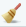
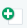
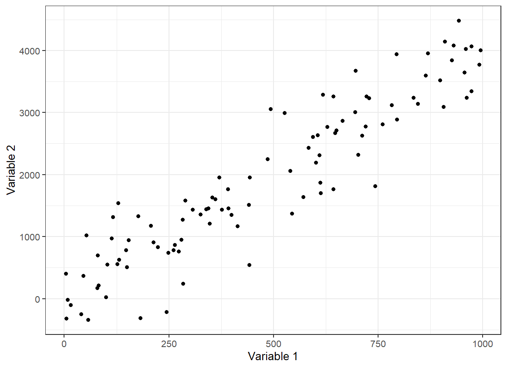

```{r setup, include=FALSE}
# This code block is to the benefit of anyone working with the .Rmd file to edit the workshop material, rather than participating in the workshop. Hence, it should always be setup to include = FALSE, so it does not appear in the knitted .md file 

# Make echo = TRUE the default option
knitr::opts_chunk$set(echo = TRUE)

# Make sure the packages are installed before running this file. If they aren't, you can run these commented install.packages() commands in the console. DO NOT UNCOMMENT THESE IN THIS DOCUMENT.
#IGNORE --install.packages("readxl")--
#IGNORE --library(readxl)--
#In the console at the beginning of your session, enter: install.packages("tidyverse", dependencies = TRUE)
#Check that you have installed knitr, tidyverse, dplyr and readxl by entering the `find.package("package_name")` in the console at the beginning of the session. 
#To see what packages you've loaded after installation, enter `sessionInfo()` in your console. each of knitr, tidyverse, dplyr and readxl should be listed in the output.
#Have the following uncommented any time you knit this Rmd file.
library(tidyverse)

# Function that will generate the .md text that creates the toggle button to show answers for activities. To use this function, you should use it inside an code chunk set with echo = FALSE (meaning, do not show) and results = "asis", meaning print the results not in a output chunk. Check the document below for an example
startCodeDetailsBlock <- function(summaryText = "Check Your Code") {
  # Use cat to directly output the string without quotes and avoid unintended newlines
  cat(
    "{::options parse_block_html=&apos;true&apos; /}<details><summary markdown='span'>", summaryText, "</summary>"
  )
}

# Function that will generate the .md text that ends the toggle button to show answers for activities. Same usage applied as explained for function above.
endCodeDetailsBlock <- function() {
  cat("</details>{::options parse_block_html=&apos;false&apos;/}")
}
```

# Data visualization

- [1. Getting Ready](#1-getting-ready)
  - [1.1 Prepare your working environment](#11-prepare-your-working-environment)
  - [1.2 Load your data](#12-load-your-data)
  - [1.3 Check your data](#13-check-your-data)
  - [1.4 Clean your data](#14-clean-your-data)
- [2. Creating plots and charts in ggplot2](#2-creating-plots-and-charts-in-ggplot2)
  - [2.1. Histograms](#21-histograms)
  - [2.2. Boxplots](#22-boxplots)
  - [2.3. Scatter Plots](#23-scatter-plots)
  - [2.4. Bar Charts](#24-bar-charts)
  - [2.5. Line Charts](#25-line-charts)

If you and your group have any questions or get stuck as you work through this in-class exercise, please ask the instructor for assistance. Have fun!

An important part of checking and analyzing data is making figures with your data to visualize the main distributions of variables, trends of association between variables etc. In this activity, you will learn how to use the `ggplot2` package (part of the `tidyverse` package) to create figures. The `ggplot2` package is a popular system for creating data visualizations like plots, charts, graphs, etc.

In this activity, you will make a histogram, a boxplot, a scatter plot, a bar chart, and a line chart.

Before you start this activity, let's give your RStudio session a fresh start. For that:

- Save your previous scripts by clicking on File > Save, or on the save icon on the top left. If needed, choose a folder to save it (probably the working directory you were working on in the previous activity) and give it a meaningful name.
- Close the script by clicking on File > Close or on the x next to the file name on the top left.
- Clean your R environment (i.e., remove all the objects) by clicking on the broom icon  on the top right and clicking yes on the pop-up window that appears.
-  Create a new script by clicking on File > New File > R Script, or on the New Script icon  on the top left.

## 1. Getting Ready

### 1.1 Prepare your working environment

You will use the `tidyverse`. You should already have the `tidyverse` package installed on your computer for previous activities.

<div class="task-box" markdown="1">

⭐ <u>Task 3-1</u>

**Prepare your working environment.**

Prepare your working environment by loading the `tidyverse` packages (the `ggplot2` package is part of the tidyverse package) and setting your working directory.

```{r echo = F, results='asis'}
startCodeDetailsBlock(summaryText = "Check your code")
```

```{r, eval = FALSE}
# load packages
library(tidyverse)

# set working directory
setwd("path-to-folder") # Remember to substitute "path-to-folder" by the actual path to your folder
```

```{r echo = F, results='asis'}
endCodeDetailsBlock()
```

</div>

### 1.2 Load your data

From [this link](docs/flavors_of_cacao.csv){:target=“\_blank”} download the following data we have prepared for you to use in this activity. Save the file in your working directory. This is a dataset that shows information about different cocoa bars such as percent cocoa, company location, cocoa bean type and rating.

<div class="task-box" markdown="1">

⭐ <u>Task 3-2</u>

**Read your data set.**

- Data set file name: `flavors_of_cacao.csv`
- Name your dataframe: `chocolateData`

```{r echo = F, results='asis'}
startCodeDetailsBlock(summaryText = "Check your code")
```

```{r, eval = FALSE}
# read data
chocolateData <- read.csv("flavors_of_cacao.csv")
```

```{r, echo = FALSE}
# read data
chocolateData <- read.csv("docs/flavors_of_cacao.csv")
```

```{r echo = F, results='asis'}
endCodeDetailsBlock()
```

*Hint:* See Activity 1 for instructions on importing a .csv file.

</div>

### 1.3 Check your data

As you are probably aware at this point, you always want to check your data to make sure it was properly imported and identify any data cleaning that is needed.

<div class="task-box" markdown="1">

⭐ <u>Task 3-3</u>

**Preview the first 5 rows of your chocolate data.**

```{r echo = F, results='asis'}
startCodeDetailsBlock(summaryText = "Check your code")
```

```{r}
# Check data
chocolateData |> 
  # Preview first 5 lines of chocolateData
  head(5) 
```

```{r echo = F, results='asis'}
endCodeDetailsBlock()
```


</div>

Another way to inspect your data is to use the `str()` function.

<div class="task-box" markdown="1">

⭐ <u>Task 3-4</u>

**See the structure of your data.**

```{r echo = F, results='asis'}
startCodeDetailsBlock(summaryText = "Check your code")
```

```{r}
# Check structure of data
str(chocolateData)
```

```{r echo = F, results='asis'}
endCodeDetailsBlock()
```
</div>

We can see that the dataset is composed of 1795 observations of chocolates, where 9 variables have been measured. The result also shows you the names of the variables and the type of each variable. It seems like this dataset is cleaned and ready to go. When working with your own dataset, you would want to make sure it passed certain data validation commands such as the ones learned in Activity 1 before continuing with data exploration and analysis. Here, we know this dataset is cleaned and can be used for the plotting activities.

------------------------------------------------------------------------

📍 Reminder! Save your work

------------------------------------------------------------------------

## 2. Creating plots and charts in ggplot2

Here is some information about creating and formatting plots, common to all types we will look at in this activity. Don’t do anything yet!

The command to begin plots and charts are very similar. Let’s first look at the commonalities. For all of them, we will use the `ggplot()` function and a geometry function. `ggplot()` parameters are:

- The dataset used for the plot `data = datasetName`
- The aesthetic mappings. This specifies which column values are assigned to the *x-axis*, and which are assigned to the *y-axis*.
  - `aes(x = columnForXAxis, y = columnForYAxis)`

The geometry function is attached to the ggplot() function with`+ geom_` and is completed by the type of plot or chart:

- histogram: `geom_histogram()`
- boxplots: `geom_boxplot()`
- scatter plot or point plots: `geom_point()`
- bar charts: `geom_bar()` or `geom_col()`
- line charts: `geom_line()`

Plots will appear in the “Plot” tab (probably in the bottom right hand quadrant of your RStudio window).

### 2.1 Histograms

Histograms are very helpful plots to look at the distribution of your variables. We already learned how to plot them using base R commands in the [Introduction to R](https://uviclibraries.github.io/rstudio/) workshop, and now we will learn how to plot them using the `ggplot2` package.

The function to plot a histogram is `geom_histogram()`. To use this function, you only need to specify one variable, and `ggplot` will automatically count the number of observations in each bin of the variable for you.

For example, to make a histogram of the cocoa percentage in chocolate bars:

```{r, message = FALSE}
# Create plot by specifying data and assign variable to the x axis
ggplot(data = chocolateData, aes(x = cocoa_percent)) +
    geom_histogram() # then add a layer of histogram bars
```
As you can see, the `cocoa_percent` variable was assigned to the x-axis, as specified, and the y-axis was automatically assigned to the count of observations in each bin.

When plotting a histogram, you can also specify the width of the bins through the argument `binwidth` or the number of bins to be used through the `bins` argument.

<div class="task-box" markdown="1">

⭐ <u>Task 3-5</u>

**Make a histogram of the cocoa percentage of bars.**

- Using chocolate data : `chocolateData`
- X-axis = cocoa percentage of chocolate bars: `coca_percent`
- Choose `binwidth = 5` inside the `geaom_histogram()` function to force the bin width to be 5% (it always uses the scale of the x variable)

```{r echo = F, results='asis'}
startCodeDetailsBlock(summaryText = "Check your code")
```

```{r}
# Create plot by specifying data and assign variables to the x axis
ggplot(data = chocolateData, aes(x = cocoa_percent)) +
    geom_histogram(binwidth = 5) # then add a layer of histogram bars, with binwidth equals to 5%
```

```{r echo = F, results='asis'}
endCodeDetailsBlock()
```

</div>

<div class="task-box" markdown="1">

⭐ <u>Task 3-6</u>

**Make a histogram of the cocoa percentage of bars.**

- Using chocolate data : `chocolateData`
- X-axis = cocoa percentage of chocolate bars: `coca_percent`
- Choose `bins = 15` inside the `geaom_histogram()` function to force the plot to have 15 bins

```{r echo = F, results='asis'}
startCodeDetailsBlock(summaryText = "Check your code")
```

```{r}
# Create plot by specifying data and assign variables to the x axis
ggplot(data = chocolateData, aes(x = cocoa_percent)) +
    geom_histogram(bins = 15) # then add a layer of histogram bars, with 15 bins
```

```{r echo = F, results='asis'}
endCodeDetailsBlock()
```

</div>

You can also specify the axes labels and a title for your axis using the `labs()` function:

- `+ labs(title = "", x = "", y = " ")`

```{r}
# Create plot by specifying data and assign variable to the x axis
ggplot(data = chocolateData, aes(x = cocoa_percent)) +
  # then add a layer of histogram bars, with 15 bins
    geom_histogram(bins = 15) + 
  # add labels and title tot he plot
  labs(title = "Histogram of cocoa percentage", 
       x = "Cocoa percentage (%)",
       y = "Number of observations")
  
```

### 2.2 Boxplots

Boxplots are another way to see the distribution of your data, by showing key statistical features of your data:

- Median: the line that divides the boxplots shows the median of your data
- Quartiles: the top and bottom ends of the boxes represent the upper and lower quartiles of your data
- Range: the lines extending from the boxes shows the range of values, excluding outliers
- Outliers: dots or other markers beyond the whiskers show potential outliers in your data

If you want to know more about boxplots, check out [this link](https://www.data-to-viz.com/caveat/boxplot.html).

The function to plot a boxplot is `geom_boxplot()`, and in the same way as the histogram, it requires only one variable to be specified (usually the y-axis, but you could also use the x-axis).

For example, to plot the boxplot of the ratings chocolate bars received

```{r}
# Create plot by specifying data and assign variable to the y axis
ggplot(data = chocolateData, aes(y = rating)) +
  # then add a layer of boxplot
    geom_boxplot() 
```
Boxplots can be useful if you want to compare the distribution of a variable between different categories. For example, imagine you want to know if the rating of chocolate bars varies according to the bean type. You can then specify `bean_type` as the second variable (for the x-axis) in the plot.

<div class="task-box" markdown="1">

⭐ <u>Task 3-7</u>

**Make a boxplot of the rating chocolate bars received by bean type**

- Using chocolate data : `chocolateData`
- X-axis = Bean type: `bean_type`
- Y-axis = Rating chocolate bars received: `rating`
- Remember to add descriptive labels and a title to your plot using the `labs()` function

```{r echo = F, results='asis'}
startCodeDetailsBlock(summaryText = "Check your code")
```

```{r}
# Create plot by specifying data and assign variable to the y axis
ggplot(data = chocolateData, aes(y = rating, x = bean_type )) +
  # then add a layer of boxplot
    geom_boxplot() +
  # add labels
  labs(title = "Rating by bean type",
       x = "Bean type",
       y = "Rating")
```
```{r echo = F, results='asis'}
endCodeDetailsBlock()
```

</div>

As you can see, some bean types, such as "Trinitario" have more variable ratings, while others, such as "Amazon" have consistently higher ratings.

However, the plot is hard to interpret, as there are many bean types. In this case, it might be best to plot only the most common bean types. For that, we first need to create a new dataset that contains only the most common bean types.

```{r}
# Get the most common bean types
bars_per_type <- chocolateData |> # get the dataframe
  group_by(bean_type) |> # group by bean type
  count() # count the number of bars per bean_type

# check the new data frame
bars_per_type
```

Now, we want to get the list of the most common bean types. Looking at the data above, you could decide to use 10 as a threshold of a sufficient number of bars being produced.

```{r}
# Get most common bean types
common_bean_types <- bars_per_type |> # get the data
  filter(n > 10) |> # filters for rows where the variable n is larger than 10
  pull(bean_type) # gets the column with bean type names
# check common bean types
common_bean_types
```
There are four types of beans with more than 10 chocolate bears being produced. Finally, we can then filter the original dataset only for the rows with these bean types.

```{r}
# Filter chocolateData to only include common beans
chocolateData_commonBeans <- chocolateData |> # Get the data
  filter(bean_type %in% common_bean_types) # Filter for rows where the value in
  # variable bean_type is present in the vector common_bean_types
```

<div class="task-box" markdown="1">

⭐ <u>Task 3-8</u>

**Make a boxplot of the rating chocolate bars received by most common bean types**

Now remake your boxplot, but only for the most common bean types.

```{r echo = F, results='asis'}
startCodeDetailsBlock(summaryText = "Check your code")
```

```{r}
# Create plot by specifying data and assign variable to the y axis
ggplot(data = chocolateData_commonBeans, aes(y = rating, x = bean_type )) +
  # then add a layer of boxplot
    geom_boxplot() +
  # add labels
  labs(title = "Rating by most common bean types",
       x = "Bean type",
       y = "Rating")
```
```{r echo = F, results='asis'}
endCodeDetailsBlock()
```

*Hint:* use the newly created object `chocolateData_commonBeans`.

</div>

As you can see, the ratings of the most common bean types are not that different.

### 2.3. Scatter Plots

Not let’s apply the ggplot commands to create a scatter plot.

**Definition - Scatter plot:** A plot with two axes, each representing a different variable. Each individual observation is shown using a single point. The position of the point is determined by the value of the variables assigned to the x and y axes for that observation.



<div class="task-box" markdown="1">

⭐ <u>Task 3-9</u>

**Make a scatter plot of the cocoa percentage and the rating a chocolate bar received.**

- Using chocolate data : `chocolateData`
- X-axis = Cocoa percentage: `cocoa_percent`
- Y-axis = Rating a chocolate bar received: `rating`
- Scatter plot function: `+ geom_point()`

```{r echo = F, results='asis'}
startCodeDetailsBlock(summaryText = "Check your code")
```

```{r}
# Create plot by specifying data and assign variables to x and y axes
ggplot(data = chocolateData, aes(x = cocoa_percent, y = rating)) +
    geom_point() # then add a layer of points
```

```{r echo = F, results='asis'}
endCodeDetailsBlock()
```

</div>

Before we add details to our plot, we need to learn about the different components. Wait until the next task to do anything.

**Definition - Fitted line:** (aka. a ‘line of best fit’) is a line representing some function of x and y that has the best fit (or the smallest overall error) for the observed data.

Function for adding a smooth line to a plot: `geom_smooth(method = "")`
- method type specifies the type of smoothing to be used

```{r echo = F, results='asis'}
startCodeDetailsBlock(summaryText = "Expand for more geom_smooth method types")
```

- *Linear Model (“lm”):* fits a linear regression model, suitable for linear relationships.
- *Locally Estimated Scatterplot Smoothing (“loess” or “lowess”)*: creates a smooth line through the plot by fitting simple models in a localized manner, which can handle non-linear relationships well. Ideal for smaller datasets
- *Generalized Additive Models (“gam”):* model complex, nonlinear trends in data. Ideal for larger datasets.
- *Moving Average (“ma”):* smooths data by creating an average of different subsets of the full dataset. It’s useful for highlighting trends in noisy data.
- *Splines (“splines”):* provide a way to smoothly interpolate between fixed points, creating a piecewise polynomial function. They are useful for fitting complex, flexible models to data.
- *Robust Linear Model (“rlm”):* Similar to linear models but less sensitive to outliers. It’s useful when your data contains outliers that might skew the results of a standard linear model.

```{r echo = F, results='asis'}
endCodeDetailsBlock()
```

- Fitted line: `method = "lm"`

<div class="task-box" markdown="1">

⭐ <u>Task 3-10</u>

**Make another scatter plot of the cocoa percentage and the rating a chocolate bar received**, with the following:

- A “line of best fit”

Remember:

- Using chocolate data: `chocolateData`
- X-axis = Cocoa percentage: `cocoa_percent`
- Y-axis = Rating a chocolate bar received: `rating`
- Line of best fit: `geom_smooth(method = "lm")`

```{r echo = F, results='asis'}
startCodeDetailsBlock(summaryText = "Check your code")
```

```{r, message = FALSE}
# Create plot by specifying data and assign variables to x and y axes
ggplot(data = chocolateData, aes(x = cocoa_percent, y = rating)) +
  geom_point() + # then add a layer of points
  geom_smooth(method = "lm") # add a fitted line using the lm method
```

```{r echo = F, results='asis'}
endCodeDetailsBlock()
```

</div>

<div class="task-box" markdown="1">

⭐ <u>Task  3-11</u>

**Add descriptive axis labels and a title to your scatter plot.**

Now also add descriptive labels using the `labs()` function.

- Title: "Rating of Chocolate Bar by Cocoa Percentage"
- X-axis labels: "Chocolate Bar Rating"
- Y-axis label: "Cocoa Percentage"

```{r echo = F, results='asis'}
startCodeDetailsBlock(summaryText = "Check your code")
```

```{r, message = FALSE}
# Create plot by specifying data and assign variables to x and y axes
ggplot(data = chocolateData, aes(x = cocoa_percent, y = rating)) +
  # then add a layer of points
  geom_point() + 
  # add a fitted line using the lm method
  geom_smooth(method = "lm") + 
  # Add labels to the plot
  labs(title = "Rating of Chocolate Bar by Cocoa Percentage", 
       x = "Chocolate Bar Rating", 
       y = "Cocoa Percentage")
```

```{r echo = F, results='asis'}
endCodeDetailsBlock()
```

</div>

------------------------------------------------------------------------

📍 Reminder! Save your work

------------------------------------------------------------------------

### 2.4. Bar Charts

A bar chart shows the relationship between a categorical variable (on the *x-axis*) and a numerical variable (on the *y-axis*). 

A common type of bar plot is one that illustrates *categories* along the x-axis and the count of observations from each category on the *y-axis*.

For this type of data, the call for bar charts in ggplot2 `geom_bar()` makes the height of the bar proportional to the number of observations in each group of a categorical variable, so you only need to tell ggplot2 the variable you want to use on the *x-axis* of your bar chart, and it makes the calculations for the *y-axis* in the background.

For example, let's make a bar chart that shows the number of chocolate bars that are made for different types of cacao beans.

<div class="task-box" markdown="1">

⭐ <u>Task  3-12</u>

**Create a basic bar chart.**

Your chart will illustrate the number of bars of different types of beans that are being made.

- Use the `chocolateData` object inside the ggplot call
- Specify the variable `bean_type` for the x-axis
- Use `+ geom_bar()` to plot a bar chart

```{r echo = F, results='asis'}
startCodeDetailsBlock(summaryText = "Check your code")
```

```{r}
# Create plot by specifying the data and the variable for the x axis
ggplot(chocolateData, aes(x = bean_type)) +
  # Add a layer of bars
  geom_bar()
```
```{r echo = F, results='asis'}
endCodeDetailsBlock()
```

*Hint:* you do not need to specify anything for the *y-axis* in this case

</div>

Again, here the plot is hard to interpret, as there are many bean types that are not commonly made. In this case, it would be again best to plot only the most common bean types, in the same way we did for the boxplot.

<div class="task-box" markdown="1">

⭐ <u>Task 3-13</u>

**Create a basic bar chart.**

Now remake your bar chart, but only for the most common bean types.

```{r echo = F, results='asis'}
startCodeDetailsBlock(summaryText = "Check your code")
```

```{r}
# Create plot by specifying the data and the variable for the x axis
ggplot(chocolateData_commonBeans, aes(x = bean_type)) +
  # Add a layer of bars
  geom_bar()
```
```{r echo = F, results='asis'}
endCodeDetailsBlock()
```

</div>

Another type of bar chart is the stacked bar chart. A stacked bar chart shows two dimensions (i.e., categorical variables) of data. Each bar will represent one category type, and each bar will be chopped into sections which represent a second category type.

<div class="task-box" markdown="1">

⭐ <u>Task 3-14</u>

**Create a stacked bar chart.**

To add a second dimension,

- following the same command as the bar chart above, modify it by:
  - adding the parameter `fill = factor2name` to `aes()`, where ‘factor2name’ is the second variable’s column name.
  - setting the parameter of `geom_bar()` to `position="stack"`
 
For this task, use `company_location` as the second variable that will chop the bars of the most common bean types into sections.

```{r echo = F, results='asis'}
startCodeDetailsBlock(summaryText = "Check your code")
```

```{r}
# Create plto by specifying data and variables assigned to x-acis and fill colour
ggplot(chocolateData_commonBeans, aes(x = bean_type, fill = company_location)) +
  # Add a layer of bars, with stacked bars of different colours
  geom_bar(position = "stack")
```
```{r echo = F, results='asis'}
endCodeDetailsBlock()
```
</div>

So far, we have looked at bar charts that plot the count of observations in different categories in the *y-axis*. But if we want the *y-axis*  to show the values of actual variables in your data? For that situation, you can use the `geom_col()` function.

For example, imagine you want to plot the average rating for the different types of beans. First, you would need to calculate the average rating per bean type. To do this, you can use the `group_by()` and `summarise()` functions your learned in the previous section:

```{r}
chocolateData_commonBeans_rating <- chocolateData_commonBeans |> # get the dataset
  group_by(bean_type) |> # group by bean type
  summarise( # summarise a variable for each bean type
    mean_rating = mean(rating) # the summary is the mean rating
  )

# see the results
chocolateData_commonBeans_rating
```
Then, you can use this new dataset to plot your bar chart.

<div class="task-box" markdown="1">

⭐ <u>Task 3-15</u>

**Create a bar chart using `geom_col()`.**

Use the object `chocolateData_commonBeans_rating` and the function `geom_col()` to plot a bar chart showing the average rating per bean type.

```{r echo = F, results='asis'}
startCodeDetailsBlock(summaryText = "Check your code")
```

```{r}
# Create a plot by specfying the data and the variables assigned to x and y axs
ggplot(chocolateData_commonBeans_rating, aes(x = bean_type, y = mean_rating)) +
  # add a layer of columns
  geom_col()
```

```{r echo = F, results='asis'}
endCodeDetailsBlock()
```

- *Hint*: you need to specify a variable for the *y-axis* when using `geom_col()`

</div>

### 2.5. Line Charts

To create a line chart, let's start first by creating a new variable that we might want to plot in a line chart. In this case, let's assume we are interested in seeing how the average chocolate rating varies through the years.

<div class="task-box" markdown="1">

⭐ <u>Task 3-16</u>

**Create an object with the mean chocolate rating by year.**

Using piping, create a new object, `meanRatingByYear`

- base data: `chocolateData`
- group_by: `review_date`
- use `summarise()` and calculate the mean of the rating variables inside the summarise

```{r echo = F, results='asis'}
startCodeDetailsBlock(summaryText = "Check your code")
```

```{r}
# Get the original dataset
meanRatingByYear <- chocolateData |>
  # Group by review data
  group_by(review_date) |>
  # Get average rating for each review date
  summarise(
    rating = mean(rating)
    )

# Now see the object created
meanRatingByYear 
```

```{r echo = F, results='asis'}
endCodeDetailsBlock()
```

- *Hint*: this will be very similar to when you calculated the mean rating by bean type above.

</div>

Now we are ready to make our line chart!

<div class="task-box" markdown="1">

⭐ <u>Task 3-17</u>

**Create a line chart using the mean chocolate rating by year.**

Here we’ll make a line chart to show how the mean rating of chocolate has changed by year.

- Your base data will be the mean rating table you just created
- the *x-axis* value will be the review date
- the *y-axis* will be the rating
- the geom type is `geom_line()`, with no parameter

After the geom type, you might want to add a line of code to make sure the x-axis label contains the actual years. For that, you can use the `scale_x_continuous` function, which take as the parameter `breaks` the vector of points to create axis breaks. To use the function, you have to use `+ scale_x_continuous(breaks = vectorofbreaks)` at the end of your plot code.

```{r echo = F, results='asis'}
startCodeDetailsBlock(summaryText = "Check your code")
```

```{r}
# Create the plot by specifying the data and the variables assigned to x and y axes
ggplot(meanRatingByYear, aes(x = review_date, y = rating)) +
  # Add a layer of line
  geom_line() +
  # Corrects the breakpoints for the x axes
  scale_x_continuous(
    breaks = meanRatingByYear$review_date  # Use actual review dates for breaks
  )
```

```{r echo = F, results='asis'}
endCodeDetailsBlock()
```

</div>

<div class="task-box" markdown="1">

⭐ <u>Task 3-18</u>

**Style your line chart.**

Using the same chart you just made, add some stylistic features and modifications.

- rename the x label to “Review Date”
- rename the y label to “Rating”
- Add a title: “Change in Rating Over Time"

```{r echo = F, results='asis'}
startCodeDetailsBlock(summaryText = "Check your code")
```

```{r}
# Create the plot by specifying the data and the variables assigned to x and y axes
ggplot(meanRatingByYear, aes(x = review_date, y = rating)) +
  # Add a layer of line
  geom_line() +
  # Corrects the breakpoints for the x axes
  scale_x_continuous(
    breaks = meanRatingByYear$review_date  # Use actual review dates for breaks
  ) +
  # Add labels
  labs(
    x = "Review Date", 
    y = "Rating", 
    title = "Change in Rating Over Time"
  ) 
```

```{r echo = F, results='asis'}
endCodeDetailsBlock()
```

</div>

Congratulations! Now you know how to use ggplot2 to plot histograms, boxplots, scatter plots, bar charts and line charts!

------------------------------------------------------------------------

📍 Reminder! Save your work

------------------------------------------------------------------------

<div class="task-box" markdown="1">

⭐ <u>Optional challenge</u>

**Plot the change in rating over time for the 4 most common bean types**

Create a line chart similar to the one above, but instead of just the one line across all chocolates, plot four lines, one for each most common bean type.

Steps:

- Create a dataframe with the mean rating by year for each most common bean type.
  - Start with the dataset `chocolateData_commonBeans`
  - Use `group_by()` and `summarize()` just as above, but group by both `review_date` and `bean_type`

- Use the dataframe created to plot the line chart.
  - Inside the `aes()` function, map the aesthetics `colour` (i.e. the colour of the line) to the `bean_type` variable

```{r echo = F, results='asis'}
startCodeDetailsBlock(summaryText = "Check your code")
```

```{r, message = FALSE}
# Get the dataset of most common bean types
meanRatingByYearType <- chocolateData_commonBeans |>
  # Group by review date and bean ty[e]
  group_by(review_date, bean_type) |>
  # Get average rating for each review date and bean type
  summarise(
    rating = mean(rating)
    )

# Now see the object created
meanRatingByYearType |> 
  head(5)

# Create the plot by specifying the data and the variables assigned to x and y axes, as well as colour
ggplot(meanRatingByYearType, aes(x = review_date, y = rating, colour = bean_type)) +
  # Add a layer of lines
  geom_line() +
  # Corrects the breakpoints for the x axes
  scale_x_continuous(
    breaks = meanRatingByYear$review_date  # Use actual review dates for breaks
  ) +
  # Add labels
  labs(
    x = "Review Date", 
    y = "Rating", 
    colour = "Bean Type",
    title = "Change in Rating Over Time for Most Common Bean Types"
  )

```

```{r echo = F, results='asis'}
endCodeDetailsBlock()
```

</div>


<script>  
function toggle(input) {
    var x = document.getElementById(input);
    if (x.style.display === "none") {
        x.style.display = "block";
    } else {
        x.style.display = "none";
    }
}
</script>
<style>
details {
    background-color: lightgray; 
    padding: 10px;
    margin: 5px;
    border-radius: 5px;
}
.task-box {
      border: 1.5px solid #ccc;
      padding: 10px;
      margin: 10px 0;
      border-radius: 5px;
      background-color: #f5f2f6;
  }
  &#10;</style>
<!--https://gist.github.com/rxaviers/7360908-->

[Earn a workshop badge](informal-credentials.html){: .btn .btn-blue }