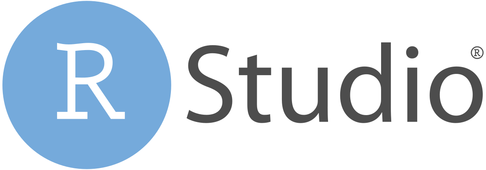

# Data Analysis with R Studio - Data manipulation and visualization

- Pre-workshop activities: 10 min 
- Introductory presentation: 10 min
- Hands-on activities: 80 min

## Why R and Rstudio? 

[R](https://cran.r-project.org/) is a free, open-source software and programming language for statistical analysis. It is available for Windows, Mac, and Linux. It allows for reproducible statistical analysis, including advanced methods, as well as the production of publication-quality graphs. Because it is free and open-source, users can also develop their methods and algorithms and release for others to use through the cration of _packages_. 

[RStudio](https://www.rstudio.com/products/rstudio/download/){:target="_blank"} is a free, open-source [integrated development environment](https://en.wikipedia.org/wiki/Integrated_development_environment) to facilitate the use of R (although it can also include other coding languages such as Python). 

"RStudio does not replace R: You must install R before you can install or use RStudio. Instead, RStudio enhances the R programming experience with helpful features such as code completion, syntax highlighting, graph and table previews, and more. RStudio's interface is organized so that the user can clearly view graphs, data tables, R code, and output all at the same time." - [Kent State University Libraries](https://libguides.library.kent.edu/statconsulting/r){:target="_blank"}

**Who is this workshop for?**: Users who are familiar with basic R concepts covered in the [Data Analysis with R Studio - Introduction to R and summary statistics.](https://uviclibraries.github.io/rstudio/){:target="_blank"} workshop. In this workshop, we focus on how to check and clean your data, as well as how to vizualize your data. We will not cover how to perform statistical analysis, which are covered in the [Data Analysis with R Studio - Introduction to R and summary statistics.](https://uviclibraries.github.io/rstudio/){:target="_blank"} and [Data Analysis with R Studio - Intermediate data analysis](https://uviclibraries.github.io/rstudio-intermediate/) workshops.

## Learning objectives

At the end of this workshop, you will be able to:

1. Manipulate and clean data with the _Tidyverse_ package
2. Check and validate your data using the _assertr_ package
3. Create basic charts and plots (scatter, bar and line plots) with the _ggplot2_ package
 
[NEXT STEP: Pre-Workshop Activities](pre-workshop.html){: .btn .btn-blue }
