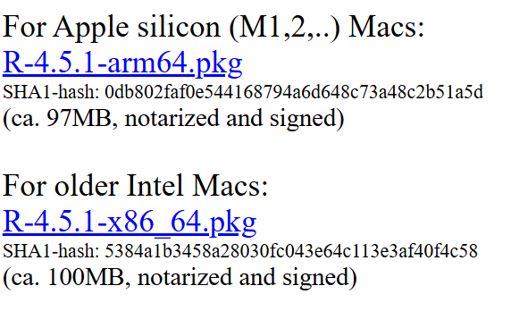

# Pre-Workshop Videos & Activities
This workshop is primarily hands-on practice with RStudio in order to learn to use key features of the software. To participate fully, please do the following **before the workshop**:

## Download & Install R and then RStudio:
- **Mac Installation**:
  - Watch the R Language Installation Guide for MacOS (3 min video) [(link to installation video)](https://youtu.be/dRkAvBz9Ibc){:target="_blank"} (3 min)
    <iframe width="560" height="315" src="https://www.youtube.com/embed/dRkAvBz9Ibc" title="YouTube video player" frameborder="0" allow="accelerometer; autoplay; clipboard-write; encrypted-media; gyroscope; picture-in-picture" allowfullscreen></iframe>
  1. [Download R Language for macOS (link to R language download)](https://cran.r-project.org/bin/macosx/){:target="_blank"}
     Look for the following on the left side of the browser window. Select one based on your Mac's chip. You can find out which chip your computer has by clicking the apple icon in the top left corner of your screen > About this Mac > Chip. It will say either "M..." or "Intel".
     
  2. [Download RStudio IDE for macOS (link to RStudio download)](https://www.rstudio.com/products/rstudio/download/){:target="_blank"} 
- **Windows Installation**:
  - Watch the R Language Installation Guide for Windows 10 (3 min video) [(link to installation video)](https://youtu.be/HqrqRMnK4XA){:target="_blank"} (3 min)
    <iframe width="560" height="315" src="https://www.youtube.com/embed/HqrqRMnK4XA?si=aYO8bgqj4RoikSPn" title="YouTube video player" frameborder="0" allow="accelerometer; autoplay; clipboard-write; encrypted-media; gyroscope; picture-in-picture" allowfullscreen></iframe>

  1. Download R Programming Language for Windows [(link to R language download)](https://cran.r-project.org/bin/windows/base/){:target="_blank"}
  2. Download RStudio IDE for Windows [(link to RStudio download)](https://www.rstudio.com/products/rstudio/download/){:target="_blank"}
 

## Review R & RStudio basic content

If you have not completed the [introductory RStudio workshop](https://uviclibraries.github.io/rstudio/){:target="_blank"}, please make sure to review its content to make sure you are familar with basic R concepts before starting this workshop.

[NEXT STEP: Introduction to Hands-On Activities](activities-intro.html){: .btn .btn-blue }
